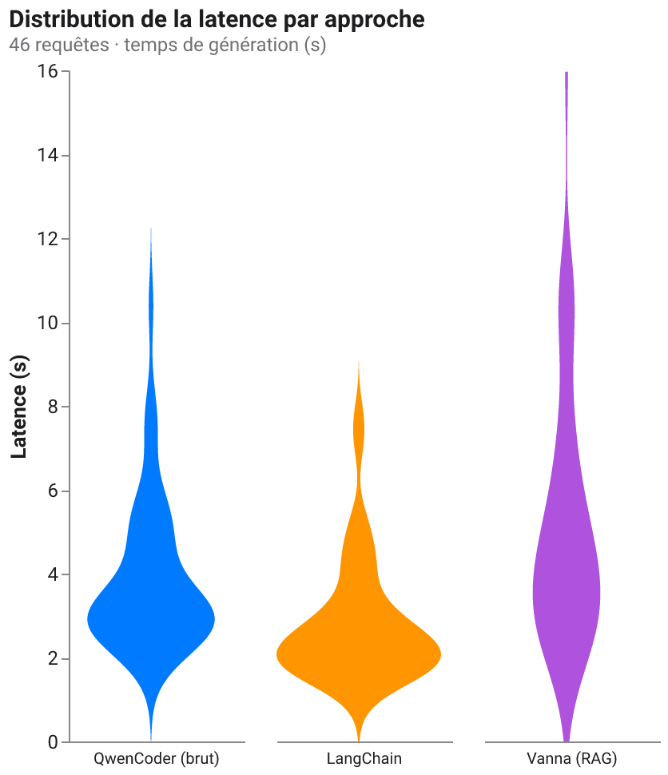
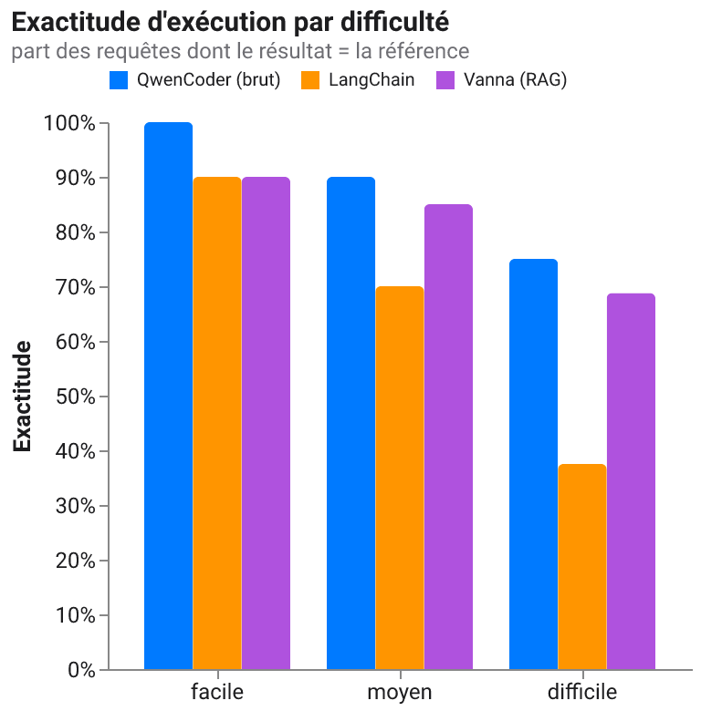
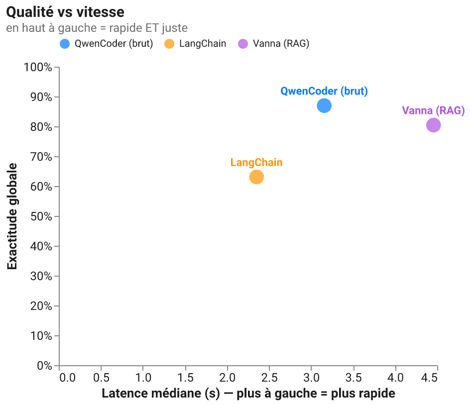

[🇫🇷](BENCHMARK.md)

# Benchmark — latence, vitesse et exactitude des trois approches

> Étude numérique comparant les trois approches text2sql (QwenCoder brut,
> LangChain, Vanna RAG) sur un **grand jeu de 46 requêtes réalistes** de l'hôpital
> fictif, réparties en trois paliers de difficulté. Tout tourne **en local via
> Ollama** (`qwen2.5-coder` pour les trois approches ; mêmes base, même garde-fou
> d'exécution). Reproductible : `python -m eval.benchmark && python -m eval.bench_charts`.

<!-- Les chiffres et figures ci-dessous sont produits par le benchmark ; ne pas
     éditer à la main : relancer `python -m eval.benchmark --repeats 2` puis
     `python -m eval.bench_charts`. -->

## Méthodologie

**Jeu de requêtes** — 46 questions en langage naturel avec, pour chacune, une
requête SQL de référence *écrite et vérifiée à la main* (`eval/benchmark_set.py`).
Trois paliers : **facile** (10 ; agrégats/filtres sur une table), **moyen**
(20 ; une jointure, GROUP BY, tri, filtres métier), **difficile** (16 ;
multi-jointures, HAVING, sous-requêtes, fonctions de date, fenêtres temporelles).

**Exactitude = exactitude d'exécution.** On ne compare pas le texte du SQL (deux
requêtes très différentes peuvent être toutes deux correctes) : on exécute le SQL
généré ET la référence, et on compare les **résultats** (métrique standard, cf.
Spider/BIRD). C'est la mesure de *qualité*.

**Latence — robuste au bruit de la machine.** La latence horloge murale d'un
portable partagé est bruitée par les autres activités. Deux garde-fous :

1. Chaque requête est générée **plusieurs fois** (`--repeats`) et l'on garde le
   **minimum** : le bruit ne fait qu'*ajouter* du temps, donc le minimum observé
   approche la latence « propre ». On rapporte **médiane** et **p95** (pas la
   moyenne, sensible aux pics).
2. Sur le chemin **QwenCoder** (que l'on instrumente entièrement), on lit en plus
   le **temps de calcul mesuré par Ollama lui-même** (`total_duration`,
   `eval_duration`) et la **vitesse `tokens/s`** (`eval_count / eval_duration`).
   Ces valeurs isolent le temps GPU/CPU *utile*, indépendamment de
   l'ordonnancement du process Python — c'est la mesure la moins polluée par la
   charge de la machine. LangChain et Vanna passant par leurs propres clients
   Ollama, on n'a pour eux que l'horloge murale (min sur répétitions).

> ⚠️ **Honnêteté méthodologique.** Ce n'est pas un banc de labo : mesuré sur un
> Mac en usage normal. Les valeurs absolues sont *indicatives* ; c'est l'**ordre
> relatif** des approches et les **écarts** qui comptent, et ceux-là survivent au
> bruit (min sur répétitions + temps serveur Ollama).

## Résultats — tableau récapitulatif

<!-- BENCH_TABLE_START -->
46 requêtes · latence = **min sur 2 répétitions** (débruitée) · exactitude = exécution.

| Approche | Exactitude | facile | moyen | difficile | Lat. médiane | Lat. p95 | Lat. min | Débit (req/min) |
|---|---:|---:|---:|---:|---:|---:|---:|---:|
| **QwenCoder (brut)** | **87 %** | 100 % | 90 % | **75 %** | 3,16 s | 7,43 s | 1,70 s | 15,5 |
| LangChain | 63 % | 90 % | 70 % | 38 % | **2,35 s** | **5,25 s** | **0,96 s** | **21,7** |
| Vanna (RAG) | 80 % | 90 % | 85 % | 69 % | 4,46 s | 10,64 s | 1,30 s | 11,6 |

**En une phrase :** QwenCoder brut est le plus **juste** (87 %, et surtout 75 % sur
le difficile), LangChain le plus **rapide** (2,35 s médian) mais le moins fiable
(63 %, s'effondre à 38 % sur le difficile), Vanna est **précis** (80 %) mais le
plus **lent** (4,46 s, longue queue jusqu'à ~16 s).
<!-- BENCH_TABLE_END -->

## Latence : distribution par approche

La violine montre la **distribution complète** du temps de génération (pas
seulement une moyenne) : on voit l'étalement et le chevauchement, et donc si les
approches sont *vraiment* différentes en vitesse ou seulement à un pic près.

## Qualité : exactitude par difficulté

## Le compromis : qualité vs vitesse

En haut à gauche = rapide **et** juste.

## Temps de calcul « utile » vs horloge murale (QwenCoder)

<!-- BENCH_COMPUTE_START -->
Sur le chemin QwenCoder, on lit le temps mesuré **par Ollama lui-même**
(`total_duration`, `eval_duration`) en plus de l'horloge murale. Verdict :

| Mesure (QwenCoder) | Valeur médiane |
|---|---:|
| Latence horloge murale | 3,16 s |
| Temps de calcul mesuré par Ollama (`total_duration`) | 3,14 s |
| Écart (overhead Python + HTTP + OS) | **≈ 0,02 s (~0,6 %)** |
| Vitesse de génération (`eval_count / eval_duration`) | **≈ 12 tokens/s** |

**Ce que ça prouve :** l'horloge murale (3,16 s) et le temps mesuré par Ollama
(3,14 s) sont **quasi identiques** → la latence observée **est** le temps de
calcul du modèle ; l'overhead Python/HTTP et le bruit des autres activités de la
machine sont **négligeables** ici (l'inférence domine tout). C'est aussi pour ça
que le classement des approches est fiable malgré une mesure sur portable.
<!-- BENCH_COMPUTE_END -->

## Lecture & limites

<!-- BENCH_TAKEAWAYS_START -->
- **Il n'y a pas de « meilleure » approche dans l'absolu — il y a un compromis.**
  Le nuage qualité/vitesse le montre : QwenCoder occupe le meilleur coin
  (haute exactitude, vitesse correcte), LangChain échange la justesse contre la
  vitesse, Vanna la vitesse contre la justesse.
- **Ce qui fait la différence de qualité, ce n'est pas le framework, c'est le
  contexte donné au modèle.** Les trois utilisent le *même* LLM local. QwenCoder
  gagne parce qu'on lui injecte les **valeurs énumérées** des colonnes et qu'il
  s'**auto-corrige** sur erreur — pas par magie de bibliothèque. LangChain, qui
  charge tout le schéma sans ces aides, s'effondre sur le difficile (38 %).
- **Le RAG de Vanna tient bien la qualité** (80 %, 69 % sur le difficile) mais
  paie la récupération vectorielle en latence (queue jusqu'à ~16 s).
- **Le classement survit au bruit.** Latence en *min sur répétitions* et temps
  serveur Ollama concordent : les écarts mesurés sont réels, pas des artefacts.

**Limites (honnêteté).** 46 requêtes (échantillon modéré) ; un seul modèle local
(`qwen2.5-coder`) sur une seule machine ; l'auto-correction et les valeurs
énumérées ne sont activées que sur QwenCoder (comparaison volontairement « à
configuration réelle », pas « à égalité stricte »). Les **valeurs absolues** sont
indicatives ; c'est l'**ordre relatif** et les **écarts** qui sont le signal. Voir
[`ASSESSMENT.md`](ASSESSMENT.md) pour l'analyse critique d'ensemble.
<!-- BENCH_TAKEAWAYS_END -->

---

Reproduire : `python -m eval.benchmark --repeats 2` (écrit
`eval/benchmark_results.json`) puis `python -m eval.bench_charts` (écrit les PNG
dans `docs/img/`). Voir aussi [`ASSESSMENT.md`](ASSESSMENT.md) et
[`PROS_CONS.md`](PROS_CONS.md).
