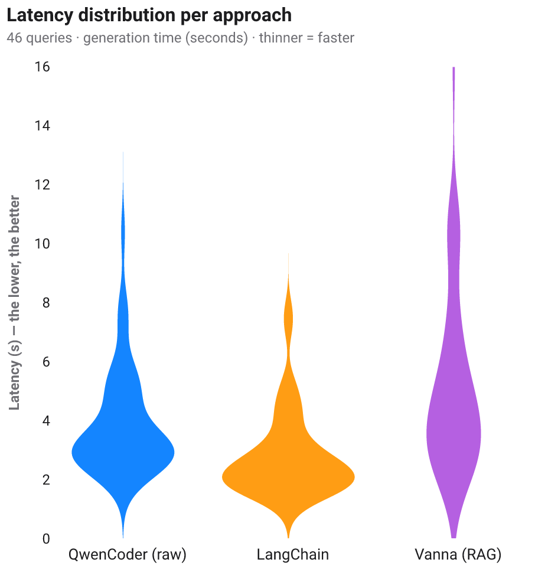
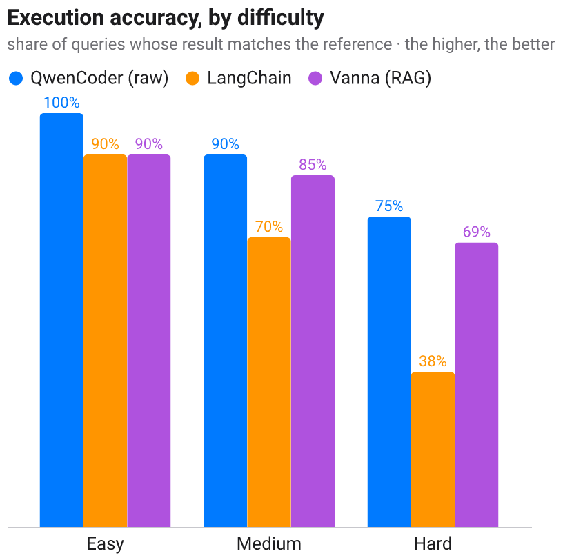
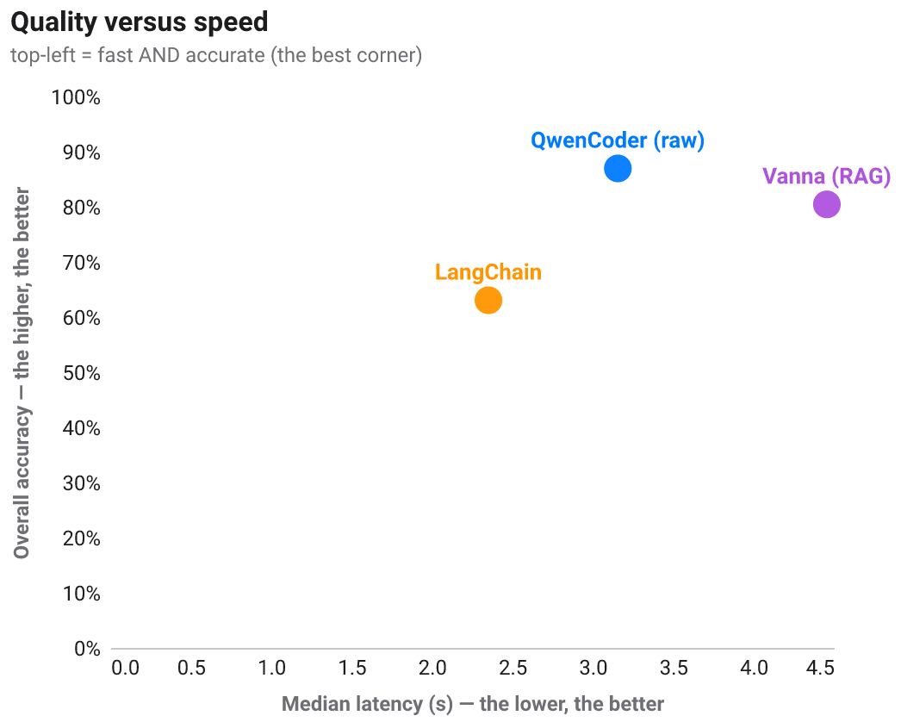

[🇫🇷](BENCHMARK.fr.md) · [🇬🇧](BENCHMARK.md)

# Benchmark — latency, speed and accuracy

> A numerical study comparing text2sql approaches on a **large 500-query set** of
> the fictional hospital. Crucially: **all four configurations share the SAME LLM**
> (`qwen2.5-coder`, locally via Ollama), the same database and the same execution
> guard — so we compare **approaches** (how the context reaches the model), not
> different models.
>
> Reproducible: `python -m eval.benchmark --repeats 1 && python -m eval.bench_charts`.

<!-- Numbers and figures are produced by the benchmark; do not edit by hand. -->

## The four configurations compared

| Config | LLM | What changes |
|---|---|---|
| **QwenCoder (good prompt)** | qwen2.5-coder | schema + **enumerated column values** + examples + **self-correction** on error |
| **QwenCoder (naive prompt)** | qwen2.5-coder | **bare** schema, minimal instruction, **no** help — the "lazy" baseline |
| **LangChain** | qwen2.5-coder | the toolbox loads the schema and prompts the LLM its own way |
| **Vanna (RAG)** | qwen2.5-coder | retrieves the relevant context (RAG) before generating |

The two QwenCoder configs differ **only by the prompt**: their gap directly
measures **what a good prompt is worth**.

## Methodology

**500-query set** — 46 hand-written, verified questions (including joins and
natural-language wording) + 454 cases generated from safe patterns over the real
schema (counts, groupings, aggregates, filters). The reference SQL is correct by
construction. Three tiers: easy / medium / hard.

**Accuracy = execution accuracy**: we run the generated SQL AND the reference and
compare the **results** (the field-standard metric, cf. Spider/BIRD).

**Noise-robust latency**: `--repeats` generations per query, keeping the
**minimum** (noise only *adds* time); we report **median** and **p95**. On the
QwenCoder path we also read the **time measured by Ollama itself**
(`total_duration`, `eval_duration`) and the **tokens/s** speed — the *useful*
compute time, immune to the machine's other activity.

> ⚠️ Measured on a laptop under normal use: absolute values are *indicative*; the
> **relative order** and the **gaps** are the signal (and they survive the noise).

## Results — summary table

<!-- BENCH_TABLE -->
_(filled after the run)_
<!-- /BENCH_TABLE -->

## A good prompt matters: good prompt vs naive prompt

<!-- BENCH_PROMPT -->
_(filled after the run — the accuracy gap between the two QwenCoder configs)_
<!-- /BENCH_PROMPT -->

## Latency: distribution per approach

## Quality: accuracy by difficulty

## The trade-off: quality vs speed

## "Useful" compute time vs wall-clock (QwenCoder)

<!-- BENCH_COMPUTE -->
_(filled after the run)_
<!-- /BENCH_COMPUTE -->

## Error analysis — to do better

We distinguish two failure kinds: **execution error** (invalid SQL, the database
rejects it) and **semantic error** (valid SQL but wrong result — the "silent
error", the most dangerous).

<!-- BENCH_ERRORS -->
_(filled after the run — exec/semantic breakdown per approach + examples)_
<!-- /BENCH_ERRORS -->

## Takeaways & limits

<!-- BENCH_TAKEAWAYS -->
_(filled after the run)_
<!-- /BENCH_TAKEAWAYS -->

---

Reproduce: `python -m eval.benchmark --repeats 1` then `python -m eval.bench_charts`.
See also [`ASSESSMENT.md`](ASSESSMENT.md) and [`PROS_CONS.md`](PROS_CONS.md).
