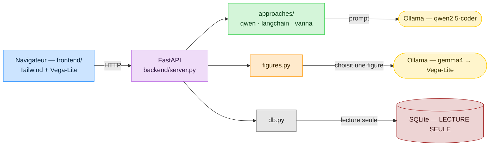
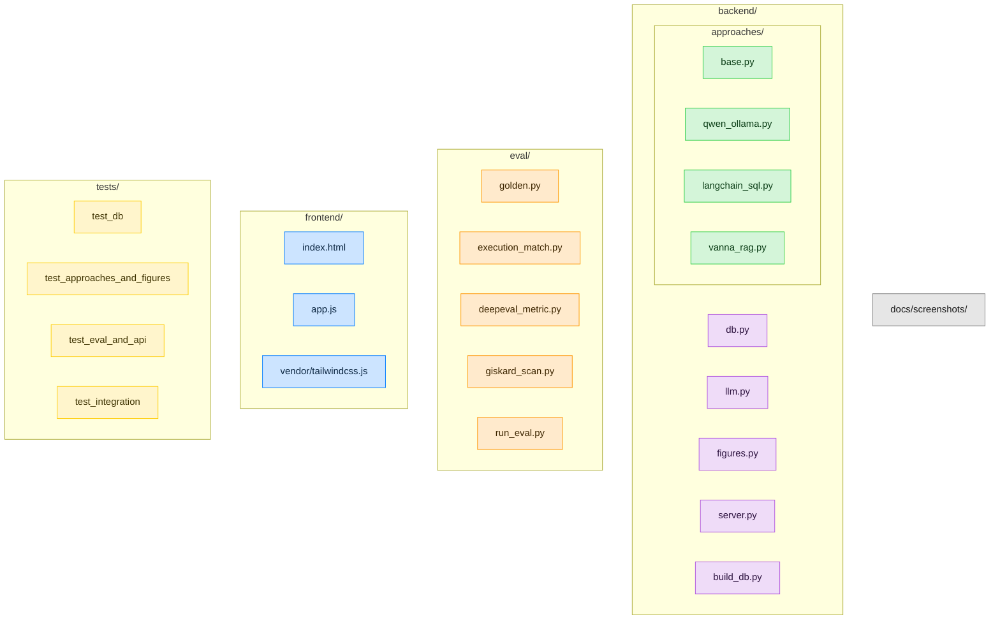

[🇫🇷](LISEZMOI.md) · [🇬🇧](README.md)

# Text2SQL — Hôpital 🏥

> **Comment on fait du « texte → SQL » ?** Une démo pédagogique, 100 % locale,
> qui traduit une question en français en requête SQL de **trois façons
> différentes**, l'exécute pour de vrai sur une base d'hôpital fictive, et trace
> le résultat avec une figure choisie par un modèle. Faite pour être montrée à
> des collègues qui demandent *« mais concrètement, ça marche comment ? »*.

Tout tourne en local via **[Ollama](https://ollama.com)** — aucune donnée ne
quitte la machine, aucune clé d'API, aucun cloud. En contexte multi-utilisateurs
et concurrentiel, je préférerais vLLM.


📖 Guides pas-à-pas illustrés : **[MODEDEMPLOI.md](MODEDEMPLOI.md)** (🇫🇷) ·
**[USERGUIDE.md](USERGUIDE.md)** (🇬🇧).

---

## Pourquoi ce projet — l'objectif pédagogique

Ce dépôt est un **artefact pédagogique**, pas un produit. Il répond concrètement à
la question que des collègues posent sans arrêt : **« le text-to-SQL, comment ça
marche vraiment, et laquelle des méthodes choisir ? »**

La plupart des tutos montrent *une* bibliothèque sur une base jouet à 2 tables et
s'arrêtent à « regardez, ça a généré du SQL ». On n'y apprend presque rien des
vraies décisions. Ce projet fait exprès l'inverse, pour qu'on *apprenne les
compromis en les voyant côte à côte* :

1. **Il rend l'idée centrale impossible à rater.** Ce qui fait la qualité d'un
   text-to-SQL, c'est *la façon dont le schéma arrive au LLM*. Les trois approches
   ne diffèrent donc **que** sur cet axe — même base, même modèle local, même
   garde-fou d'exécution — et affichent leur SQL généré à chaque fois. On *lit* la
   différence au lieu qu'on nous la raconte : un prompt écrit à la main
   (**QwenCoder brut**), un framework qui le fait pour vous (**LangChain**), et la
   récupération du seul contexte pertinent (**Vanna, RAG**).
2. **Il tourne pour de vrai sur une base crédible.** Un hôpital de 30 tables et
   ~33 000 lignes (médical, RH, compta, matériel, pharmacie, essais cliniques) —
   parce que c'est sur des vraies questions et des vraies jointures que le
   text-to-SQL naïf casse, et qu'une base jouet cacherait justement ce qu'il faut
   montrer.
3. **Il est honnête sur l'échec.** Il *mesure* la qualité (exactitude d'exécution,
   comme Spider/BIRD), livre un jeu de questions faciles **et** un jeu difficile
   exprès pour exposer le vrai plafond, et son [`ASSESSMENT.md`](ASSESSMENT.md) dit
   franchement ce qui marche et ce qui ne marche pas. La leçon n'est pas « les LLM
   écrivent du SQL » — c'est que le dur, c'est de garantir que le SQL répond à la
   *bonne* question.
4. **Il montre les garde-fous, pas seulement la magie.** Exécution en lecture
   seule, pourquoi on n'exécute jamais le code produit par un LLM, pourquoi la CVE
   de Vanna compte, et comment un modèle (**Gemma**) peut choisir une *figure* sans
   risque (une spec Vega-Lite, pas du code exécuté).
5. **Il est 100 % local (Ollama).** La démo peut être lancée, inspectée et modifiée
   par n'importe qui, sans clé d'API, sans coût, et sans qu'aucune donnée ne quitte
   la machine — tout l'intérêt d'un objet dont on apprend *en le démontant*.

En bref : lisez le code et la doc de bout en bout et vous devriez repartir en
comprenant **comment** marche le text-to-SQL, **quelle** approche va avec **quelle**
situation, et **pourquoi** la réponse honnête est « ça dépend ».

---

## Ce que ça démontre

Trois approches text2sql, du plus « bas niveau » au plus « framework », comparées
côte à côte sur la même question :

| # | Approche | Idée | Ce qu'on apprend |
|---|----------|------|------------------|
| 1 | **QwenCoder brut** (`qwen2.5-coder` via Ollama) | On écrit nous-mêmes le prompt (schéma + question). Zéro framework. | La mécanique de base, sans magie. |
| 2 | **LangChain** (`SQLDatabase` + LCEL) | La « toolbox connue » introspecte le schéma et prompte le LLM pour toi. | Ce qu'un framework fait à ta place. |
| 3 | **Vanna AI** (RAG + ChromaDB) | On « entraîne » un index (schéma + savoir métier + exemples) ; seul le contexte pertinent est récupéré à l'exécution. | Comment passer à l'échelle sur un gros schéma. |

… plus **Gemma** (`gemma4`) qui **choisit la visualisation** adaptée au résultat
et renvoie une spec **Vega-Lite** rendue dans le navigateur.

📄 Comparatif détaillé et sourcé (benchmarks Spider/BIRD, sécurité, CVE Vanna) :
**[`PROS_CONS.md`](PROS_CONS.md)**.

---

## La base : un hôpital fictif

`data/institut.db` (SQLite, généré, déterministe) : **30 tables, ~33 000 lignes**,
avec un parcours de soins cohérent (diagnostic → traitement → cures/séances/
chirurgie → imagerie → labo → facturation).

| Domaine | Tables (extrait) |
|---------|------------------|
| 🩺 Médical | `patients`, `diagnostics` (CIM-10 + TNM), `traitements`, `cures_chimio`, `seances_radio`, `chirurgies`, `consultations`, `examens_imagerie`, `biopsies`, `resultats_labo`, `sejours` |
| 🔬 Recherche | `essais_cliniques`, `inclusions_essai` |
| 👥 RH | `employes`, `contrats`, `absences`, `formations`, `services` |
| 💶 Comptabilité | `factures`, `lignes_facture`, `paiements`, `actes` |
| 📦 Achats / Matériel | `fournisseurs`, `commandes`, `lignes_commande`, `equipements`, `maintenances` |
| 💊 Pharmacie | `medicaments`, `stocks`, `mouvements_stock` |

> ⚠️ Données **100 % synthétiques** (Faker, seed figée). Aucune donnée réelle,
> aucun patient réel.

---

## Architecture



**Sécurité** : le SQL généré par un LLM n'est jamais exécuté par les frameworks
eux-mêmes. Toute exécution passe par `backend/db.py` : connexion SQLite
`mode=ro`, un seul `SELECT` autorisé, mots-clés d'écriture refusés, `LIMIT`
défensif. (Motivé notamment par l'historique de RCE de Vanna, cf. `PROS_CONS.md`.)

---

## Prérequis

- **Python ≥ 3.10**
- **Ollama** (serveur de modèles local) :
  - macOS 🍎 : `brew install ollama`
    (installez `brew` grâce à [brew.sh](https://brew.sh/))
  - Ubuntu 🐧 : `curl -fsSL https://ollama.com/install.sh | sh`
  - Windows 🪟 : `winget install Ollama.Ollama`
- **Les modèles** (tirés automatiquement par `start.sh`, ou à la main) :
  ```bash
  ollama pull qwen2.5-coder       # génération SQL
  ollama pull gemma4:e4b          # choix des figures (ou une variante gemma déjà présente)
  ollama pull nomic-embed-text    # embeddings pour le RAG de Vanna
  ```

---

## Installation & lancement

```bash
pip install -r requirements.txt   # cœur + LangChain + Vanna + éval
ollama serve                      # dans un terminal séparé
./start.sh                        # vérifie Ollama, tire les modèles, construit la base, démarre
# puis ouvrez http://localhost:8000
```

Ou manuellement :

```bash
python -m backend.build_db                       # génère data/institut.db
uvicorn backend.server:app --reload --port 8000  # API + front
```

📘 Recettes complètes (API Python, curl, éval) : **[`EXAMPLES.md`](EXAMPLES.md)**.

---

## Évaluation IA

La qualité d'un système text2sql se mesure par l'**exactitude d'exécution** : le
SQL généré renvoie-t-il le même résultat que le SQL de référence ? (métrique
standard, cf. Spider/BIRD). Jeu de référence dans `eval/golden.py`, seuils
versionnés dans `eval/run_eval.py`.

```bash
python -m eval.run_eval --approach qwen          # jeu facile → 100 % (10/10)
python -m eval.run_eval --approach qwen --hard   # jeu difficile → le vrai plafond (~83 %)
python -m eval.run_eval --approach vanna
```

Le **jeu difficile** (`GOLDEN_HARD` : regroupements temporels, HAVING,
multi-jointures, fonctions de date) existe exprès — un 100 % sur des questions
faciles ne prouve rien ; le `--hard` montre où un modèle local craque vraiment.

- **[DeepEval](https://github.com/confident-ai/deepeval)** : la métrique
  d'exactitude d'exécution est empaquetée en `BaseMetric` **100 % locale**
  (aucun juge OpenAI) — `eval/deepeval_metric.py`.
- **[Giskard](https://github.com/Giskard-AI/giskard)** : scan de **robustesse**
  (invariance de la réponse aux perturbations de la question) —
  `eval/giskard_scan.py`.

---

## Tests

```bash
pytest -q -m "not slow"     # suite rapide (sans Ollama) — tourne en CI
pytest -m slow              # intégration : appelle vraiment les modèles locaux
ruff check . && ruff format --check .   # style PEP 8
```

La CI (`.github/workflows/ci.yml`) exécute le lint + la suite rapide sur chaque
push / PR.

---

## Structure



---

## Accessibilité

L'interface vise **WCAG 2.1 AA**, vérifié avec l'outillage front du projet :

- **Lint a11y statique** → 0 finding (alt manquant, contrôles sans label, ordre
  des titres, sémantique des dialogues, etc.).
- **Audit de contraste WCAG** → toutes les paires de texte passent AA « normal ».
  Le bleu de marque a été assombri (`#007AFF` → `#0063cc`) pour que les boutons
  texte-blanc-sur-bleu atteignent 4.5:1 ; footer et badge de latence corrigés aussi.
- **Audit data-viz** des specs Vega-Lite → propre (titres d'axes, pas de double
  axe, pas de palette arc-en-ciel / non-CVD-safe).
- **ARIA** : `aria-pressed` sur les boutons d'approche, `aria-live`/`aria-busy`
  sur la zone de résultats, `role="img"` + `<figcaption>` sur chaque figure,
  `scope` + `<caption>` sur les tables, focus rings visibles, garde `motion-reduce`.

## Notes

- Ce dépôt suit un **standard de code** strict (docstrings numpy, typage,
  commentaires abondants, tests, éval, Ruff/PEP 8) — voir `CODING.md`.
- Le client Ollama est un copié-collé simplifié du framework local
  [`roitelet`](https://github.com/) de l'auteur (aucune dépendance importée).
- Suivi de construction horodaté : [`todo.md`](todo.md).

## Licence & remerciements

MIT. Remerciements chaleureux aux contributrices, contributeurs, relectrices,
relecteurs et utilisateurs qui ont aidé à améliorer ce projet.
