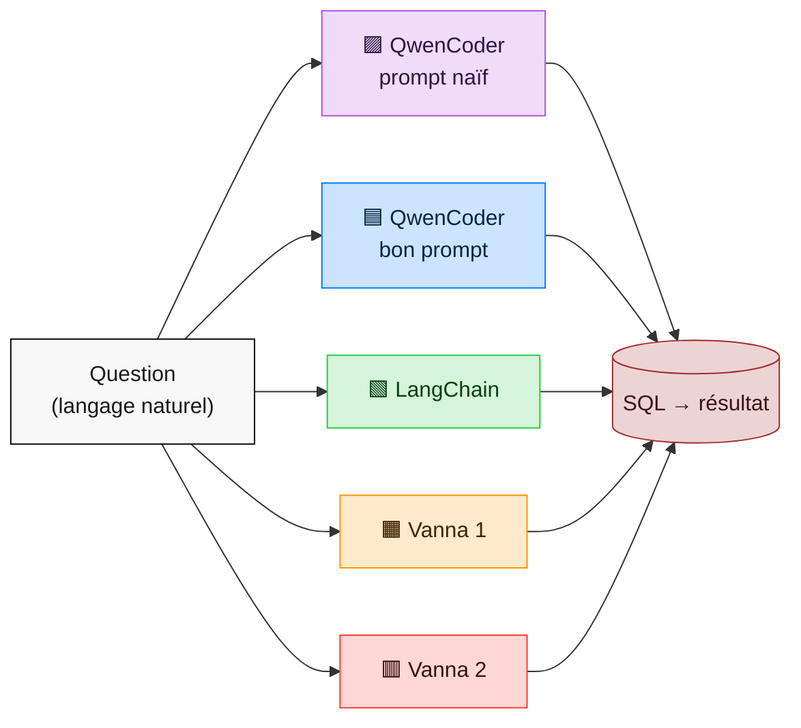
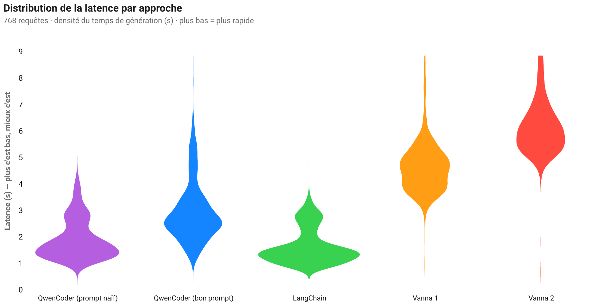
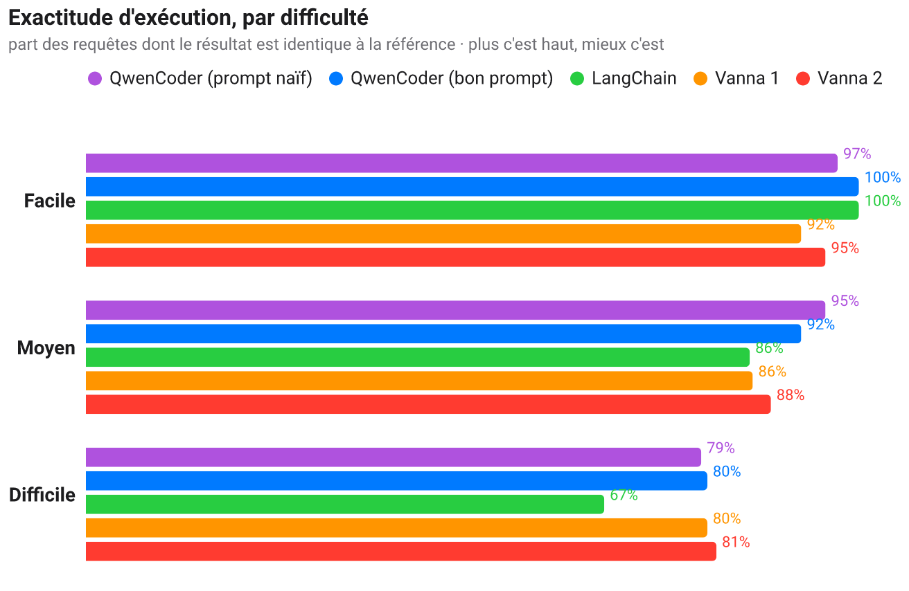
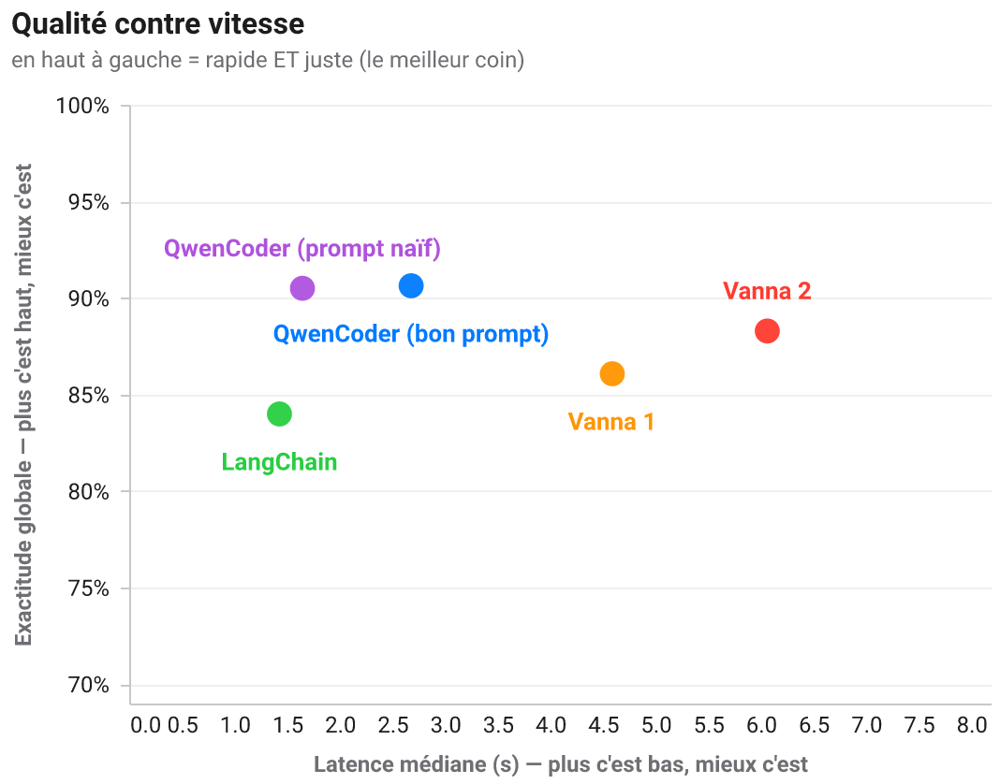
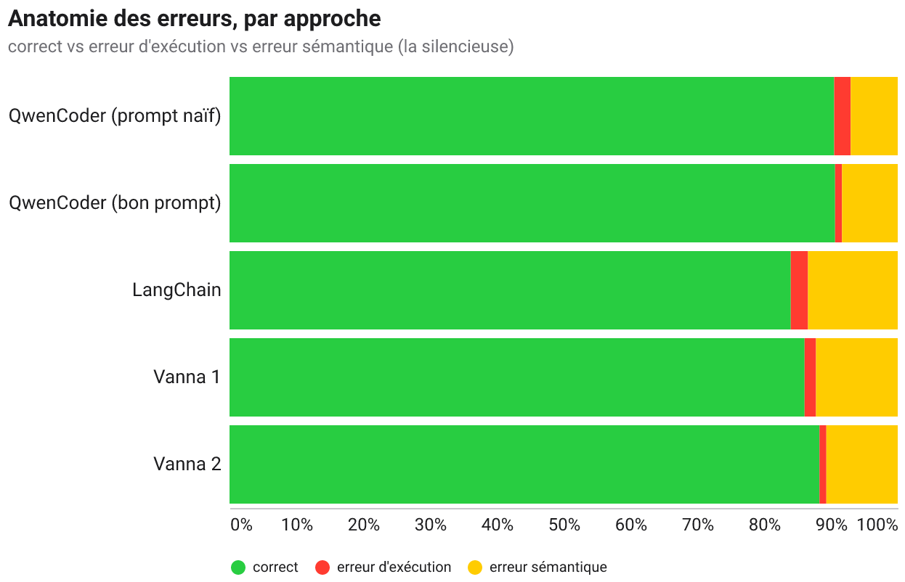
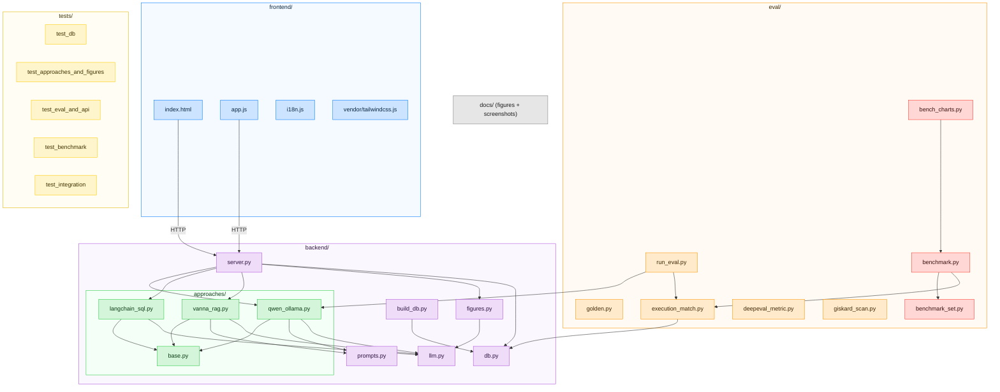

# text2SQL — Hôpital 🏥

[🇫🇷](LISEZMOI.md) · [🇬🇧](README.md)


> **Comment on fait du « texte → SQL » ?** Une démo pédagogique, 100 % locale,
> qui traduit une question en français en requête SQL de **trois façons
> différentes**, l'exécute pour de vrai sur une base d'hôpital fictive, et trace
> le résultat avec une figure choisie par un modèle. Faite pour être montrée à
> des collègues qui demandent *« mais concrètement, ça marche comment ? »*.

Tout tourne en local via **[Ollama](https://ollama.com)** — aucune donnée ne
quitte la machine, aucune clé d'API, aucun cloud. En contexte multi-utilisateurs
et concurrentiel, je préférerais vLLM.


📖 Guides pas-à-pas illustrés : **[MODEDEMPLOI.md](MODEDEMPLOI.md)** (🇫🇷) ·
**[USERGUIDE.md](USERGUIDE.md)** (🇬🇧).

---

## Pourquoi ce projet — l'objectif pédagogique

Ce dépôt est un **artefact pédagogique**, pas un produit. Il répond concrètement à
la question que des collègues posent sans arrêt : **« le text-to-SQL, comment ça
marche vraiment, et laquelle des méthodes choisir ? »**

La plupart des tutos montrent *une* bibliothèque sur une base jouet à 2 tables et
s'arrêtent à « regardez, ça a généré du SQL ». On n'y apprend presque rien des
vraies décisions. Ce projet fait exprès l'inverse, pour qu'on *apprenne les
compromis en les voyant côte à côte* :

1. **Il rend l'idée centrale impossible à rater.** Ce qui fait la qualité d'un
   text-to-SQL, c'est *la façon dont le schéma arrive au LLM*. Les trois approches
   ne diffèrent donc **que** sur cet axe — même base, même modèle local, même
   garde-fou d'exécution — et affichent leur SQL généré à chaque fois. On *lit* la
   différence au lieu qu'on nous la raconte : un prompt écrit à la main
   (**QwenCoder brut**), un framework qui le fait pour vous (**LangChain**), et la
   récupération du seul contexte pertinent (**Vanna, RAG**).
2. **Il tourne pour de vrai sur une base crédible.** Un hôpital de 30 tables et
   ~33 000 lignes (médical, RH, compta, matériel, pharmacie, essais cliniques) —
   parce que c'est sur des vraies questions et des vraies jointures que le
   text-to-SQL naïf casse, et qu'une base jouet cacherait justement ce qu'il faut
   montrer.
3. **Il est honnête sur l'échec.** Il *mesure* la qualité (exactitude d'exécution,
   comme Spider/BIRD), livre un jeu de questions faciles **et** un jeu difficile
   exprès pour exposer le vrai plafond, et son [`ASSESSMENT.md`](ASSESSMENT.md) dit
   franchement ce qui marche et ce qui ne marche pas. La leçon n'est pas « les LLM
   écrivent du SQL » — c'est que le dur, c'est de garantir que le SQL répond à la
   *bonne* question.
4. **Il montre les garde-fous, pas seulement la magie.** Exécution en lecture
   seule, pourquoi on n'exécute jamais le code produit par un LLM, pourquoi la CVE
   de Vanna compte, et comment un modèle (**Gemma**) peut choisir une *figure* sans
   risque (une spec Vega-Lite, pas du code exécuté).
5. **Il est 100 % local (Ollama).** La démo peut être lancée, inspectée et modifiée
   par n'importe qui, sans clé d'API, sans coût, et sans qu'aucune donnée ne quitte
   la machine — tout l'intérêt d'un objet dont on apprend *en le démontant*.

En bref : lisez le code et la doc de bout en bout et vous devriez repartir en
comprenant **comment** marche le text-to-SQL, **quelle** approche va avec **quelle**
situation, et **pourquoi** la réponse honnête est « ça dépend ».

---

## Ce que ça démontre

Trois approches text2sql, du plus « bas niveau » au plus « framework », comparées
côte à côte sur la même question :

| # | Approche | Idée | Ce qu'on apprend |
|---|----------|------|------------------|
| 1 | **QwenCoder brut** (`qwen2.5-coder` via Ollama) | On écrit nous-mêmes le prompt (schéma + question). Zéro framework. | La mécanique de base, sans magie. |
| 2 | **LangChain** (`SQLDatabase` + LCEL) | La « toolbox connue » introspecte le schéma et prompte le LLM pour toi. | Ce qu'un framework fait à ta place. |
| 3 | **Vanna AI** (RAG + ChromaDB) | On « entraîne » un index (schéma + savoir métier + exemples) ; seul le contexte pertinent est récupéré à l'exécution. | Comment passer à l'échelle sur un gros schéma. |

… plus **Gemma** (`gemma4`) qui **choisit la visualisation** adaptée au résultat
et renvoie une spec **Vega-Lite** rendue dans le navigateur.

📄 Comparatif détaillé et sourcé (benchmarks Spider/BIRD, sécurité, CVE Vanna) :
**[`PROS_CONS.md`](PROS_CONS.md)**.

---

## La base : un hôpital fictif

`data/institut.db` (SQLite, généré, déterministe) : **30 tables, ~33 000 lignes**,
avec un parcours de soins cohérent (diagnostic → traitement → cures/séances/
chirurgie → imagerie → labo → facturation).

| Domaine | Tables (extrait) |
|---------|------------------|
| 🩺 Médical | `patients`, `diagnostics` (CIM-10 + TNM), `traitements`, `cures_chimio`, `seances_radio`, `chirurgies`, `consultations`, `examens_imagerie`, `biopsies`, `resultats_labo`, `sejours` |
| 🔬 Recherche | `essais_cliniques`, `inclusions_essai` |
| 👥 RH | `employes`, `contrats`, `absences`, `formations`, `services` |
| 💶 Comptabilité | `factures`, `lignes_facture`, `paiements`, `actes` |
| 📦 Achats / Matériel | `fournisseurs`, `commandes`, `lignes_commande`, `equipements`, `maintenances` |
| 💊 Pharmacie | `medicaments`, `stocks`, `mouvements_stock` |

> ⚠️ Données **100 % synthétiques** (Faker, seed figée). Aucune donnée réelle,
> aucun patient réel.

---

## Architecture


**Sécurité** : le SQL généré par un LLM n'est jamais exécuté par les frameworks
eux-mêmes. Toute exécution passe par `backend/db.py` : connexion SQLite
`mode=ro`, un seul `SELECT` autorisé, mots-clés d'écriture refusés, `LIMIT`
défensif. (Motivé notamment par l'historique de RCE de Vanna, cf. `PROS_CONS.md`.)

---

## Prérequis

- **Python ≥ 3.10**
- **Ollama** (serveur de modèles local) :
  - macOS 🍎 : `brew install ollama`
    (installez `brew` grâce à [brew.sh](https://brew.sh/))
  - Ubuntu 🐧 : `curl -fsSL https://ollama.com/install.sh | sh`
  - Windows 🪟 : `winget install Ollama.Ollama`
- **Les modèles** (tirés automatiquement par `start.sh`, ou à la main) :
  ```bash
  ollama pull qwen2.5-coder       # génération SQL
  ollama pull gemma4:e4b          # choix des figures (ou une variante gemma déjà présente)
  ollama pull nomic-embed-text    # embeddings pour le RAG de Vanna
  ```

---

## Installation & lancement

```bash
pip install -r requirements.txt   # cœur + LangChain + Vanna + éval
ollama serve                      # dans un terminal séparé
./start.sh                        # vérifie Ollama, tire les modèles, construit la base, démarre
# puis ouvrez http://localhost:8000
```

Ou manuellement :

```bash
python -m backend.build_db                       # génère data/institut.db
uvicorn backend.server:app --reload --port 8000  # API + front
```

📘 Recettes complètes (API Python, curl, éval) : **[`EXAMPLES.md`](EXAMPLES.md)**.

---

## Évaluation IA

La qualité d'un système text2sql se mesure par l'**exactitude d'exécution** : le
SQL généré renvoie-t-il le même résultat que le SQL de référence ? (métrique
standard, cf. Spider/BIRD). Jeu de référence dans `eval/golden.py`, seuils
versionnés dans `eval/run_eval.py`.

```bash
python -m eval.run_eval --approach qwen          # jeu facile → 100 % (10/10)
python -m eval.run_eval --approach qwen --hard   # jeu difficile → le vrai plafond (~83 %)
python -m eval.run_eval --approach vanna
```

Le **jeu difficile** (`GOLDEN_HARD` : regroupements temporels, HAVING,
multi-jointures, fonctions de date) existe exprès — un 100 % sur des questions
faciles ne prouve rien ; le `--hard` montre où un modèle local craque vraiment.

- **[DeepEval](https://github.com/confident-ai/deepeval)** : la métrique
  d'exactitude d'exécution est empaquetée en `BaseMetric` **100 % locale**
  (aucun juge OpenAI) — `eval/deepeval_metric.py`.
- **[Giskard](https://github.com/Giskard-AI/giskard)** : scan de **robustesse**
  (invariance de la réponse aux perturbations de la question) —
  `eval/giskard_scan.py`.

---

## Benchmark — latence, vitesse et exactitude

> Étude numérique comparant les approches text2sql sur un **jeu équilibré de 768
> requêtes** de l'hôpital fictif (**256 faciles / 256 moyens / 256 difficiles**).
> Point crucial : **les cinq configurations partagent le MÊME LLM**
> (`qwen2.5-coder`, en local via Ollama), la même base et le même garde-fou
> d'exécution — on compare donc les **approches** (la façon de donner le contexte
> au modèle), pas des modèles différents.
>
> Reproductible : `python -m eval.benchmark --repeats 1 && python -m eval.bench_charts`.

### Les cinq configurations comparées

Chaque moteur garde **une couleur** dans toutes les figures (Vega + Mermaid) et dans
ce texte, issue de la palette
[harchaoui.org/warith/colors](https://harchaoui.org/warith/colors/) — la couleur
porte le sens du moteur :

| Moteur | Couleur | Sens (palette) |
|---|---|---|
| 🟪 **QwenCoder (prompt naïf)** | Violet `#AF52DE` | le jumeau « paresseux » (schéma nu) |
| 🟦 **QwenCoder (bon prompt)** | Bleu `#007AFF` | Trust / Fiable — on contrôle tout |
| 🟩 **LangChain** | Vert `#28CD41` | Fraîcheur / Croissance — la toolbox populaire |
| 🟧 **Vanna 1** | Orange `#FF9500` | Friendly — RAG sous-nourri |
| 🟥 **Vanna 2** | Rouge `#FF3B30` | Puissance / Force — le RAG nourri |

| Config | LLM | Ce qui change |
|---|---|---|
| 🟪 **QwenCoder (prompt naïf)** | qwen2.5-coder | schéma **nu**, consigne minimale, **aucune** aide — le témoin « paresseux » |
| 🟦 **QwenCoder (bon prompt)** | qwen2.5-coder | schéma + **valeurs énumérées** des colonnes + exemples + **auto-correction** sur erreur |
| 🟩 **LangChain** | qwen2.5-coder | la toolbox charge le schéma et prompte le LLM à sa façon (sans auto-correction) |
| 🟧 **Vanna 1** | qwen2.5-coder | RAG légèrement entraîné : DDL + quelques docs + 4 exemples + **auto-correction** |
| 🟥 **Vanna 2** | qwen2.5-coder | RAG avec la **même info décisive** que le bon prompt (valeurs énumérées) + 15 exemples + **auto-correction** |

Deux paires de témoins, **une seule leçon** : ce qui compte, ce n'est pas la boîte,
c'est **l'information qu'on met dans le contexte**.



### Méthodologie

**Jeu équilibré de 768 requêtes** — 256 par palier. Un noyau de questions écrites et
vérifiées à la main (jointures, formulations naturelles) + un grand lot généré par
patrons sûrs sur le schéma réel (comptages, regroupements, agrégats, filtres,
jointures, HAVING, anti-jointures, dates). Le SQL de référence est correct par
construction ; **toutes** les 768 références s'exécutent. **Exactitude = exactitude
d'exécution** : on exécute le SQL généré ET la référence et on compare les
**résultats** (cf. Spider/BIRD). **Latence robuste au bruit** : `--repeats`
générations par requête, on garde le **minimum** ; on rapporte **médiane** et
**p95**, plus le **temps mesuré par Ollama** sur le chemin QwenCoder (le calcul
*utile*, insensible aux autres activités de la machine).

> ⚠️ Mesuré sur un portable en usage normal : valeurs absolues *indicatives*, c'est
> l'**ordre relatif** et les **écarts** qui comptent (et ils survivent au bruit).

### Les trois paliers de difficulté — ce que « Facile / Moyen / Difficile » veut dire

Découper le jeu en trois paliers, c'est refuser qu'**une moyenne unique cache où un
modèle casse**. Un modèle peut afficher 95 % global et rester inutilisable sur les
questions qu'on pose vraiment (les difficiles). Chaque palier isole une compétence
SQL précise :

| Palier | Compétence SQL testée | Exemple de question | Pourquoi ce niveau |
|---|---|---|---|
| **Facile** | Une table, un agrégat ou un filtre. Aucune jointure. | *« Combien de patients au total ? »* → `SELECT COUNT(*) FROM patients` | Le modèle doit juste trouver **une** table et une colonne. S'il échoue ici, il n'a pas compris le schéma du tout. |
| **Moyen** | Tri / somme / moyenne, `GROUP BY`, filtre sur une valeur, regroupement par mois. Encore surtout une table. | *« Chiffre d'affaires encaissé par mois en 2026 »* → `GROUP BY strftime('%Y-%m', date)` + `SUM(...)` | Le modèle doit choisir la bonne **agrégation** et la bonne **colonne à filtrer/grouper** — c'est là que les *valeurs énumérées* commencent à compter (`statut = 'Payée'`, pas `'Paid'`). |
| **Difficile** | **Jointures** multi-tables, `HAVING`, sous-requêtes, **anti-jointures** (`NOT IN`), fonctions de date, seuils médians. | *« Quels services ont une masse salariale au-dessus de la médiane ? »* (jointure `employes`→`services` + `HAVING`) ; *« patients sans facture »* (anti-jointure `NOT IN`) | Le modèle doit **naviguer les clés étrangères**, garder la bonne granularité et combiner plusieurs clauses. C'est là que les modèles locaux — et les prompts génériques — s'effondrent, et là que le classement devient parlant. |

Lisez donc les paliers comme une **rampe de difficulté** : tout le monde réussit le
Facile ; les écarts s'ouvrent au Moyen (valeurs) et explosent au Difficile
(jointures + logique). Une méthode ne vaut que sa colonne **Difficile**.

### Résultats — tableau récapitulatif

768 requêtes, une génération chacune (`--repeats 1`), même LLM partout.

| Config | Exactitude | Facile | Moyen | **Difficile** | Lat. méd. | p95 | Débit | Err. exéc. | **Err. sémant.** |
|---|---:|---:|---:|---:|---:|---:|---:|---:|---:|
| 🟪 QwenCoder (prompt naïf) | 90,5 % | 97 % | 95 % | 79 % | 1,65 s | 3,45 s | ~36/min | 19 | 54 |
| 🟦 **QwenCoder (bon prompt)** | **90,6 %** | 100 % | 92 % | 80 % | 2,68 s | 5,57 s | ~22/min | **8** | 64 |
| 🟩 LangChain | 84,0 % | 100 % | 86 % | **67 %** | **1,43 s** | 2,97 s | ~42/min | 20 | **103** |
| 🟧 Vanna 1 | 86,1 % | 92 % | 86 % | 80 % | 4,59 s | 7,79 s | ~13/min | 13 | 94 |
| 🟥 **Vanna 2** | 88,3 % | 95 % | 88 % | **81 %** | 6,06 s | 10,54 s | ~10/min | **8** | 82 |

**Lecture honnête.** Les deux QwenCoder mènent en global (~90,5 %), puis **Vanna 2
(88,3 %)**, **Vanna 1 (86,1 %)** et LangChain (84,0 %). Deux choses comptent plus que
ce classement global. D'abord la colonne **difficile** : sur les requêtes qui
séparent vraiment les méthodes, **Vanna 2 est désormais le meilleur de tous (81 %)** —
la récupération ciblée d'un RAG bien nourri paie exactement là où les jointures et la
logique se corsent. Ensuite, donner à Vanna la **même auto-correction** que le bon
prompt (voir plus bas) est ce qui a comblé l'écart — mais ça en fait le **plus lent**
(6 s en médiane). LangChain reste le plus rapide et le moins fiable (67 % sur le
difficile, 103 erreurs silencieuses). **Qualité et vitesse tirent en sens opposés, et
aucune config ne gagne les deux.**

### Un bon prompt, ça joue : bon prompt vs prompt naïf

Même modèle, mêmes 768 questions — seul le prompt change. L'écart d'exactitude
**global** est minuscule (**90,6 % vs 90,5 %**), et ça nous a surpris. Explication
honnête plutôt qu'un slogan : la plupart des questions générées *épellent la valeur
de filtre exacte* (« …dont le `statut` vaut « Impayée » »). Or la chose la plus
décisive qu'injecte un bon prompt — les **valeurs énumérées** des colonnes — est
*déjà donnée par la question*. Sur des questions **naturelles** où la valeur n'est
*pas* épelée (« combien de factures sont **impayées** ? », cf. `eval/run_eval` et la
démo live), l'avance du bon prompt est bien plus grande. **Leçon : la façon d'écrire
le benchmark décide si l'on peut seulement *voir* l'effet du prompt.** Ce que le bon
prompt achète quand même, visiblement : **erreurs d'exécution plus que divisées par
deux (8 vs 19)** grâce à l'auto-correction, et une avance sur facile+difficile.

### Latence, qualité et le compromis







**Temps de calcul « utile » (QwenCoder).** Les compteurs d'Ollama montrent que le bon
prompt tourne à **13,1 tokens/s** (calcul médian 2,67 s) contre **22,0 tokens/s**
(1,63 s) pour le naïf — ~60 % de la vitesse et ~1 s de calcul de plus par requête.
Deux raisons : un contexte bien plus gros (schéma complet + valeurs énumérées +
exemples), et l'auto-correction qui déclenche une *deuxième* génération en cas
d'échec. **C'est le prix de la fiabilité.**

### Analyse des erreurs — pour faire mieux

Une mauvaise réponse n'est pas juste « fausse » — **la façon** dont elle est fausse
change tout. On sépare chaque échec en deux types fondamentalement différents :

- 🔴 **Erreur d'exécution** — le SQL généré est **invalide** : mauvais nom de colonne,
  jointure impossible, faute de syntaxe. La base le **refuse** et renvoie une erreur.
  C'est le *bon* type d'échec : il est **bruyant**. On le voit tout de suite, on peut
  le journaliser, le réessayer, ou basculer sur un secours. Personne n'est trompé.
  L'auto-correction (re-prompter le modèle avec le message d'erreur de la base) en
  répare la plupart automatiquement.
- 🟡 **Erreur sémantique** — le SQL est **parfaitement valide et s'exécute**, mais il
  répond à la **mauvaise question** : il a filtré `statut = 'En attente'` quand on
  demandait *impayées* (`'Impayée'`), ou sommé la mauvaise colonne, ou oublié une
  condition de jointure. La base renvoie un **tableau de chiffres d'apparence
  plausible**, sans le moindre avertissement. C'est le type **dangereux** — le
  *tueur silencieux*. Un humain recopie le chiffre dans un rapport et personne ne
  remarque jamais qu'il était faux.

**Tout le jeu du text-to-SQL en production, c'est de transformer les erreurs
sémantiques en erreurs d'exécution (ou en bonnes réponses).** Une requête invalide
est une gêne ; une requête faussement sûre d'elle est un danger. C'est pourquoi les
deux colonnes ci-dessous comptent plus que l'exactitude affichée : deux méthodes
peuvent avoir le même score global et être à des années-lumière en **confiance**.



Le graphique ci-dessus est normalisé par approche — 🟢 vert = correct, 🔴 rouge =
erreur d'exécution (bruyante, rattrapable), 🟡 jaune = erreur sémantique (silencieuse,
dangereuse). **Moins il y a de jaune, plus on peut faire confiance à la réponse sans
la vérifier à la main.**

| Config | Err. exécution | Err. sémantiques | Total faux (/768) |
|---|---:|---:|---:|
| 🟪 QwenCoder (prompt naïf) | 19 | 54 | 73 |
| 🟦 QwenCoder (bon prompt) | 8 | 64 | 72 |
| 🟩 LangChain | 20 | **103** | 123 |
| 🟧 Vanna 1 | 13 | 94 | 107 |
| 🟥 Vanna 2 | **8** | 82 | 90 |

1. **L'auto-correction écrase les erreurs d'exécution** — les deux configs à boucle de
   réparation (bon QwenCoder et Vanna 2) ne sont qu'à **8** échecs SQL-invalide
   chacune. Ajouter cette même boucle à Vanna, c'est ce qui l'a fait remonter : les
   erreurs d'exécution de Vanna 1 tombent **31 → 13** et celles de Vanna 2 **46 → 8**
   face aux versions sans réparation — **+2 à +3 points** d'exactitude, gratuitement.
2. **Nourrir les valeurs se voit encore dans la colonne *silencieuse*.** Vanna 2 a
   moins d'erreurs sémantiques que Vanna 1 (82 vs 94) *et* bien moins d'erreurs
   d'exécution — les valeurs énumérées l'orientent vers le bon filtre, la boucle de
   réparation rattrape le reste. C'est cette combinaison qui fait passer Vanna 2
   (88,3 %) devant Vanna 1 (86,1 %) et lui donne la victoire sur le palier difficile.
3. **LangChain est rapide mais peu sûr :** 103 erreurs sémantiques, de loin le plus,
   et aucune boucle de réparation. **La vitesse n'est pas la sûreté.**

### Lecture & limites

1. **Même modèle, contexte différent → fiabilité différente.** Les cinq configs font
   tourner `qwen2.5-coder` ; les ~7 points d'écart sont achetés uniquement par *ce
   qu'on met dans le contexte*. C'est toute la thèse.
2. **Le bon prompt gagne sur les extrêmes et le profil d'erreurs, pas sur la
   moyenne** — ici il fait jeu égal avec le naïf parce que les questions templatées
   lui donnent les valeurs exactes. Sur des questions naturelles, il se détache bien
   plus.
3. **Donnez les mêmes armes à un RAG et il rattrape presque.** Ajouter
   l'auto-correction et les valeurs énumérées à Vanna l'a fait passer de **84,2 →
   86,1 %** (Vanna 1) et **85,4 → 88,3 %** (Vanna 2). **Sur le palier difficile,
   Vanna 2 (81 %) est désormais LA meilleure config** — récupérer le *bon* exemple
   compte le plus justement quand la requête est complexe.
4. **Mais le contexte complet garde l'avantage global sur un petit schéma.** Même à
   armes égales (les deux s'auto-corrigent), le prompt schéma-complet de QwenCoder
   (90,6 %) reste devant Vanna 2 (88,3 %) sur facile/moyen. Sur une vraie base
   (milliers de colonnes qui *ne tiennent pas* dans un prompt) le classement s'inverse
   et le RAG devient nécessaire — cf. [`PROS_CONS.md`](PROS_CONS.md).
5. **Vitesse ≠ sûreté, et la qualité a un prix.** LangChain est le plus rapide et le
   moins sûr (103 erreurs silencieuses, 67 % sur le difficile). Vanna 2 est le plus
   exact sur le difficile mais le **plus lent** (6 s en médiane) — l'auto-correction
   relance une génération à chaque échec. Aucune config ne gagne les deux axes.
6. **Limite honnête :** des questions templatées qui citent la valeur de filtre
   exacte *sous-estiment* la valeur d'un bon contexte. Les écarts observés sont une
   **borne basse** de ce que vaut un bon contexte en production.

Le miroir anglais de cette étude vit dans [`README.md`](README.md).

---

## Tests

```bash
pytest -q -m "not slow"     # suite rapide (sans Ollama) — tourne en CI
pytest -m slow              # intégration : appelle vraiment les modèles locaux
ruff check . && ruff format --check .   # style PEP 8
```

La CI (`.github/workflows/ci.yml`) exécute le lint + la suite rapide sur chaque
push / PR.

---

## Structure



---

## Accessibilité

L'interface vise **WCAG 2.1 AA**, vérifié avec l'outillage front du projet :

- **Lint a11y statique** → 0 finding (alt manquant, contrôles sans label, ordre
  des titres, sémantique des dialogues, etc.).
- **Audit de contraste WCAG** → toutes les paires de texte passent AA « normal ».
  Le bleu de marque a été assombri (`#007AFF` → `#0063cc`) pour que les boutons
  texte-blanc-sur-bleu atteignent 4.5:1 ; footer et badge de latence corrigés aussi.
- **Audit data-viz** des specs Vega-Lite → propre (titres d'axes, pas de double
  axe, pas de palette arc-en-ciel / non-CVD-safe).
- **ARIA** : `aria-pressed` sur les boutons d'approche, `aria-live`/`aria-busy`
  sur la zone de résultats, `role="img"` + `<figcaption>` sur chaque figure,
  `scope` + `<caption>` sur les tables, focus rings visibles, garde `motion-reduce`.

## Notes

- Ce dépôt suit un **standard de code** strict (docstrings numpy, typage,
  commentaires abondants, tests, éval, Ruff/PEP 8) — voir `CODING.md`.
- Le client Ollama a été copier-coller de manière simplifiée du framework 
  [`roitelet`](https://github.com/warith-harchaoui/roitelet) de l'auteur.
- Suivi de construction horodaté : [`todo.md`](todo.md).

