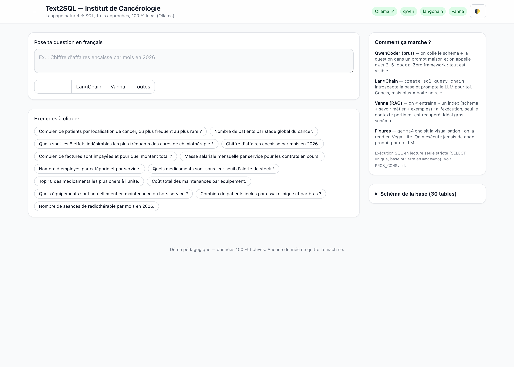

[🇫🇷](LISEZMOI.md) · [🇬🇧](README.md)

# Text2SQL — Hospital 🏥

> **How do you turn plain language into SQL?** A hands-on, 100 % local demo that
> translates a French question into a SQL query **three different ways**, runs it
> for real against a fictional hospital database, and charts the result with a
> figure a model picks for you. Built to show colleagues who ask *"but concretely,
> how does it actually work?"*.

Everything runs locally through **[Ollama](https://ollama.com)** — no data leaves
the machine, no API key, no cloud.



📖 Illustrated step-by-step guides: **[USERGUIDE.md](USERGUIDE.md)** (🇬🇧) ·
**[MODEDEMPLOI.md](MODEDEMPLOI.md)** (🇫🇷).

---

## Why this project exists — the pedagogical goal

This repository is a **teaching artefact**, not a product. It was built to answer,
concretely, a question colleagues keep asking: **"text-to-SQL — how does it
actually work, and which way should we do it?"**

Most tutorials show *one* library on a toy 2-table database and stop at "look, it
generated some SQL". That teaches almost nothing about the real decisions. This
project is deliberately different, so that a reader *learns the trade-offs by
seeing them side by side*:

1. **It makes the core idea impossible to miss.** The one thing that decides
   text-to-SQL quality is *how the database schema reaches the LLM*. So the three
   approaches differ **only** on that axis — same database, same local model,
   same execution guard — and show their generated SQL every time. You read the
   difference instead of being told about it: a hand-written prompt (**QwenCoder,
   raw**), a framework that does it for you (**LangChain**), and retrieval of just
   the relevant context (**Vanna, RAG**).
2. **It runs for real on a believable database.** A 30-table, ~33k-row hospital
   (medical, HR, accounting, equipment, pharmacy, clinical trials) — because
   real questions and real joins are where naive text-to-SQL breaks, and a toy
   schema would hide exactly what students need to see.
3. **It is honest about failure.** It *measures* accuracy (execution accuracy,
   like Spider/BIRD), ships an easy **and** a deliberately hard question set to
   expose the real ceiling, and its [`ASSESSMENT.md`](ASSESSMENT.md) says plainly
   what works and what doesn't. The lesson isn't "LLMs write SQL" — it's that the
   hard part is guaranteeing the SQL answers the *right* question.
4. **It shows the guardrails, not just the magic.** Read-only execution, why
   LLM-generated code is never `exec`'d, why Vanna's CVE matters, and how a model
   (**Gemma**) can pick a *chart* safely (a Vega-Lite spec, not executed code).
5. **It is 100 % local (Ollama).** So the demo can be run, inspected, and modified
   by anyone, with no API key, no cost, and no data leaving the machine — the
   whole point of a thing you learn *from* by taking it apart.

In short: read the code and the docs top-to-bottom and you should come away
understanding **how** text-to-SQL works, **which** approach fits **which**
situation, and **why** the honest answer is "it depends".

---

## What it demonstrates

Three text2sql approaches, from the most "low-level" to the most "framework",
compared side by side on the same question:

| # | Approach | Idea | What you learn |
|---|----------|------|----------------|
| 1 | **Raw QwenCoder** (`qwen2.5-coder` via Ollama) | We write the prompt ourselves (schema + question). Zero framework. | The plumbing, with no magic. |
| 2 | **LangChain** (`SQLDatabase` + LCEL) | The well-known toolbox introspects the schema and prompts the LLM for you. | What a framework does on your behalf. |
| 3 | **Vanna AI** (RAG + ChromaDB) | You "train" an index (schema + business knowledge + examples); only the relevant context is retrieved at query time. | How to scale to a large schema. |

… plus **Gemma** (`gemma4`), which **picks the right visualization** for the
result and returns a **Vega-Lite** spec rendered in the browser.

📄 Detailed, sourced comparison (Spider/BIRD benchmarks, security, Vanna CVE):
**[`PROS_CONS.md`](PROS_CONS.md)**.

---

## The database: a fictional hospital

`data/institut.db` (SQLite, generated, deterministic): **30 tables, ~33,000 rows**,
with a coherent care pathway (diagnosis → treatment → chemo cycles / radiotherapy
sessions / surgery → imaging → lab → billing).

| Domain | Tables (excerpt) |
|--------|------------------|
| 🩺 Medical | `patients`, `diagnostics` (ICD-10 + TNM), `traitements`, `cures_chimio`, `seances_radio`, `chirurgies`, `consultations`, `examens_imagerie`, `biopsies`, `resultats_labo`, `sejours` |
| 🔬 Research | `essais_cliniques`, `inclusions_essai` |
| 👥 HR | `employes`, `contrats`, `absences`, `formations`, `services` |
| 💶 Accounting | `factures`, `lignes_facture`, `paiements`, `actes` |
| 📦 Procurement / Equipment | `fournisseurs`, `commandes`, `lignes_commande`, `equipements`, `maintenances` |
| 💊 Pharmacy | `medicaments`, `stocks`, `mouvements_stock` |

> ⚠️ **100 % synthetic** data (Faker, fixed seed). No real data, no real patients.

---

## Architecture

```
Browser (frontend/)  ──HTTP──►  FastAPI (backend/server.py)
  Tailwind + Vega-Lite               │
                                     ├─ approaches/  ─► Ollama (qwen2.5-coder)
                                     │    qwen · langchain · vanna
                                     ├─ figures.py   ─► Ollama (gemma4) → Vega-Lite
                                     └─ db.py         ─► SQLite (READ-ONLY)
```

**Security**: LLM-generated SQL is never executed by the frameworks themselves.
All execution goes through `backend/db.py`: SQLite `mode=ro` connection, a single
`SELECT` allowed, write keywords rejected, defensive `LIMIT`. (Motivated in part
by Vanna's RCE history, see `PROS_CONS.md`.)

---

## Requirements

- **Python ≥ 3.10**
- **Ollama** (local model server):
  - macOS 🍎: `brew install ollama`
    (install `brew` via [brew.sh](https://brew.sh/))
  - Ubuntu 🐧: `curl -fsSL https://ollama.com/install.sh | sh`
  - Windows 🪟: `winget install Ollama.Ollama`
- **The models** (pulled automatically by `start.sh`, or by hand):
  ```bash
  ollama pull qwen2.5-coder       # SQL generation
  ollama pull gemma4:e4b          # figure choice (or a gemma variant you already have)
  ollama pull nomic-embed-text    # embeddings for Vanna's RAG
  ```

---

## Install & run

```bash
pip install -r requirements.txt   # core + LangChain + Vanna + eval
ollama serve                      # in a separate terminal
./start.sh                        # checks Ollama, pulls models, builds the DB, starts
# then open http://localhost:8000
```

Or manually:

```bash
python -m backend.build_db                       # generates data/institut.db
uvicorn backend.server:app --reload --port 8000  # API + front
```

📘 Full recipes (Python API, curl, eval): **[`EXAMPLES.md`](EXAMPLES.md)**.

---

## AI evaluation

Text2sql quality is measured by **execution accuracy**: does the generated SQL
return the same result as the reference SQL? (the field-standard metric, cf.
Spider/BIRD). Reference set in `eval/golden.py`, versioned thresholds in
`eval/run_eval.py`.

```bash
python -m eval.run_eval --approach qwen          # easy set → 100% (10/10)
python -m eval.run_eval --approach qwen --hard   # hard set → the real ceiling (~83%)
python -m eval.run_eval --approach vanna
```

The **hard set** (`GOLDEN_HARD`: temporal grouping, HAVING, multi-joins, date
functions) exists on purpose — a 100% score on easy questions proves little; the
`--hard` run shows where a local model actually breaks down.

- **[DeepEval](https://github.com/confident-ai/deepeval)**: the execution-accuracy
  metric is wrapped as a **fully local** `BaseMetric` (no OpenAI judge) —
  `eval/deepeval_metric.py`.
- **[Giskard](https://github.com/Giskard-AI/giskard)**: **robustness** scan
  (answer invariance under question perturbations) — `eval/giskard_scan.py`.

---

## Tests

```bash
pytest -q -m "not slow"     # fast suite (no Ollama) — runs in CI
pytest -m slow              # integration: actually calls the local models
ruff check . && ruff format --check .   # PEP 8 style
```

CI (`.github/workflows/ci.yml`) runs lint + the fast suite on every push / PR.

---

## Layout

```
backend/      db.py · llm.py · figures.py · server.py · build_db.py
  approaches/ base.py · qwen_ollama.py · langchain_sql.py · vanna_rag.py
eval/         golden.py · execution_match.py · deepeval_metric.py · giskard_scan.py · run_eval.py
frontend/     index.html · app.js · vendor/tailwindcss.js
tests/        test_db · test_approaches_and_figures · test_eval_and_api · test_integration
docs/         screenshots/
```

---

## Accessibility

The web UI targets **WCAG 2.1 AA**, verified with the project's front-end tooling:

- **Static a11y lint** → 0 findings (missing alt, unlabelled controls, heading
  order, dialog semantics, etc.).
- **WCAG contrast audit** → all text pairs pass AA "normal". The brand blue was
  darkened (`#007AFF` → `#0063cc`) so white-on-blue buttons clear 4.5:1; the
  footer and latency badge were fixed too.
- **Data-viz audit** on the Vega-Lite specs → clean (axis titles, no dual-axis,
  no rainbow/CVD-unsafe palette).
- **ARIA**: `aria-pressed` on the approach toggles, `aria-live`/`aria-busy` on
  the results region, `role="img"` + `<figcaption>` on every chart, `scope` +
  `<caption>` on result tables, visible focus rings, `motion-reduce` guards.

## Notes

- This repository follows a strict **coding standard** (numpy docstrings, typing,
  generous comments, tests, eval, Ruff/PEP 8) — see `CODING.md`.
- The Ollama client is a simplified copy-paste from the author's local
  [`roitelet`](https://github.com/) framework (no dependency imported).
- Timestamped build log: [`todo.md`](todo.md).

## License & acknowledgements

MIT. Special thanks to the contributors, reviewers, and users who helped improve
this project.
