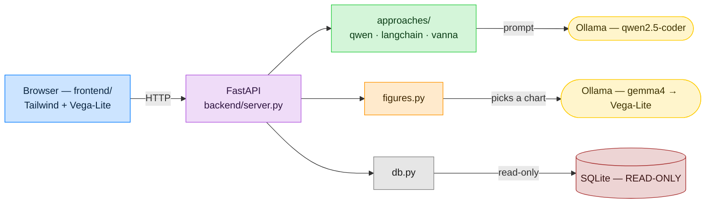
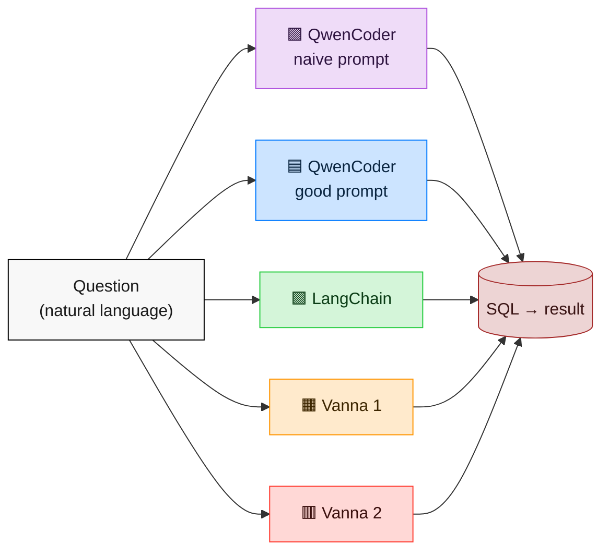
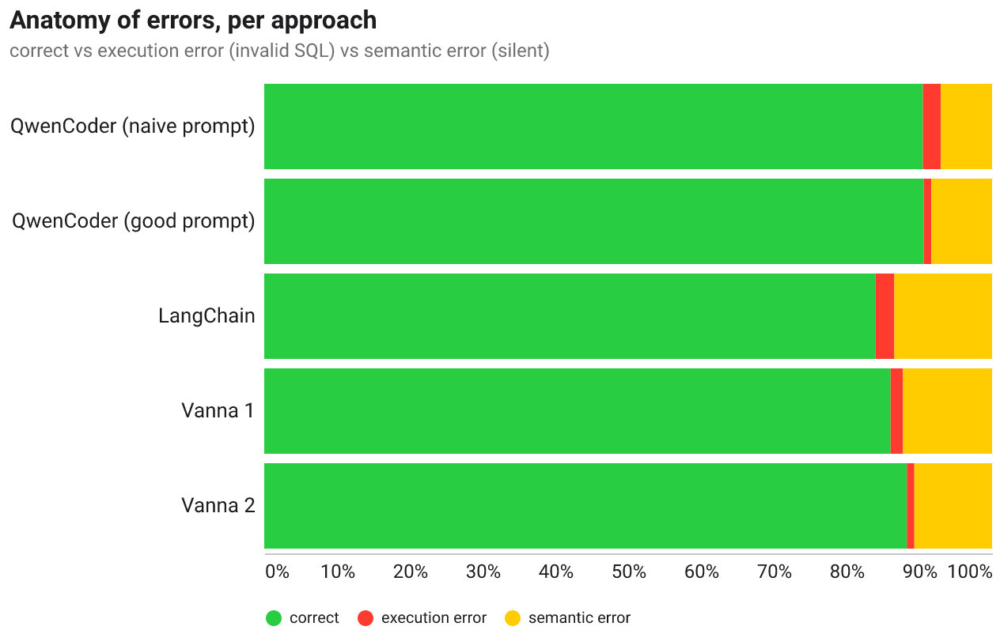
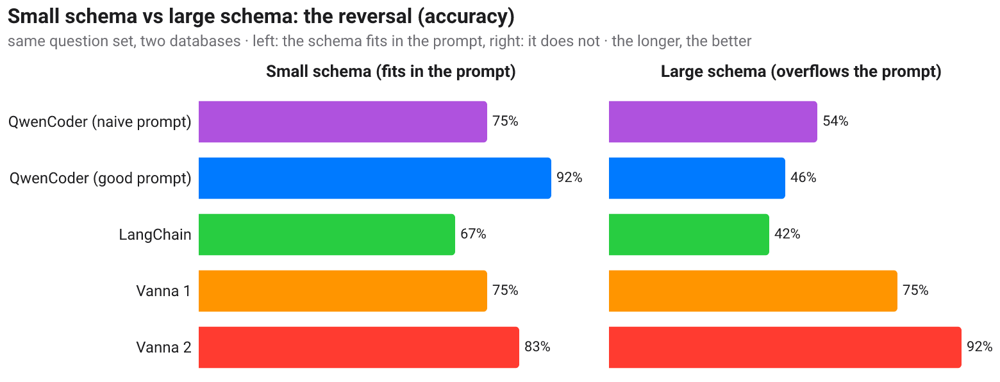
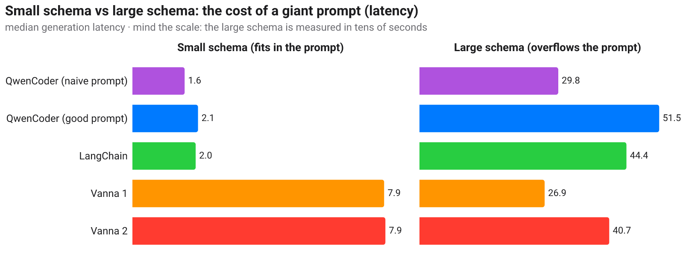
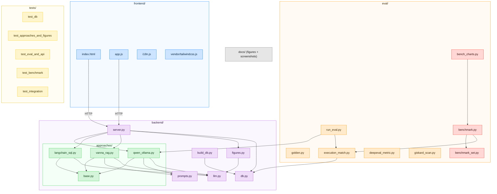

# text2SQL — Hospital 🏥

[🇫🇷](LISEZMOI.md) · [🇬🇧](README.md)

> **How do you turn plain language into SQL?** A hands-on, 100 % local demo that
> translates a French question into a SQL query **three different ways**, runs it
> for real against a fictional hospital database, and charts the result with a
> figure a model picks for you. Built to show colleagues who ask *"but concretely,
> how does it actually work?"*.

Everything runs locally through **[Ollama](https://ollama.com)** — no data leaves
the machine, no API key, no cloud. With concurrency and multi users, I would
prefer vLLM.


📖 Illustrated step-by-step guides: **[USERGUIDE.md](USERGUIDE.md)** (🇬🇧) ·
**[MODEDEMPLOI.md](MODEDEMPLOI.md)** (🇫🇷).

---

## Why this project exists — the pedagogical goal

This repository is a **teaching artefact**, not a product. It was built to answer,
concretely, a question colleagues keep asking: **"text-to-SQL — how does it
actually work, and which way should we do it?"**

Most tutorials show *one* library on a toy 2-table database and stop at "look, it
generated some SQL". That teaches almost nothing about the real decisions. This
project is deliberately different, so that a reader *learns the trade-offs by
seeing them side by side*:

1. **It makes the core idea impossible to miss.** The one thing that decides
   text-to-SQL quality is *how the database schema reaches the LLM*. So the three
   approaches differ **only** on that axis — same database, same local model,
   same execution guard — and show their generated SQL every time. You read the
   difference instead of being told about it: a hand-written prompt (**QwenCoder,
   raw**), a framework that does it for you (**LangChain**), and retrieval of just
   the relevant context (**Vanna, RAG**).
2. **It runs for real on a believable database.** A 30-table, ~33k-row hospital
   (medical, HR, accounting, equipment, pharmacy, clinical trials) — because
   real questions and real joins are where naive text-to-SQL breaks, and a toy
   schema would hide exactly what students need to see.
3. **It is honest about failure.** It *measures* accuracy (execution accuracy,
   like Spider/BIRD), ships an easy **and** a deliberately hard question set to
   expose the real ceiling, and its [`ASSESSMENT.md`](ASSESSMENT.md) says plainly
   what works and what doesn't. The lesson isn't "LLMs write SQL" — it's that the
   hard part is guaranteeing the SQL answers the *right* question.
4. **It shows the guardrails, not just the magic.** Read-only execution, why
   LLM-generated code is never `exec`'d, why Vanna's CVE matters, and how a model
   (**Gemma**) can pick a *chart* safely (a Vega-Lite spec, not executed code).
5. **It is 100 % local (Ollama).** So the demo can be run, inspected, and modified
   by anyone, with no API key, no cost, and no data leaving the machine — the
   whole point of a thing you learn *from* by taking it apart.

In short: read the code and the docs top-to-bottom and you should come away
understanding **how** text-to-SQL works, **which** approach fits **which**
situation, and **why** the honest answer is "it depends".

---

## What it demonstrates

Three text2sql approaches, from the most "low-level" to the most "framework",
compared side by side on the same question:

| # | Approach | Idea | What you learn |
|---|----------|------|----------------|
| 1 | **Raw QwenCoder** (`qwen2.5-coder` via Ollama) | We write the prompt ourselves (schema + question). Zero framework. | The plumbing, with no magic. |
| 2 | **LangChain** (`SQLDatabase` + LCEL) | The well-known toolbox introspects the schema and prompts the LLM for you. | What a framework does on your behalf. |
| 3 | **Vanna AI** (RAG + ChromaDB) | You "train" an index (schema + business knowledge + examples); only the relevant context is retrieved at query time. | How to scale to a large schema. |

… plus **Gemma** (`gemma4`), which **picks the right visualization** for the
result and returns a **Vega-Lite** spec rendered in the browser.

📄 Detailed, sourced comparison (Spider/BIRD benchmarks, security, Vanna CVE):
**[`PROS_CONS.md`](PROS_CONS.md)**.

---

## The database: a fictional hospital

`data/institut.db` (SQLite, generated, deterministic): **30 tables, ~33,000 rows**,
with a coherent care pathway (diagnosis → treatment → chemo cycles / radiotherapy
sessions / surgery → imaging → lab → billing).

| Domain | Tables (excerpt) |
|--------|------------------|
| 🩺 Medical | `patients`, `diagnostics` (ICD-10 + TNM), `traitements`, `cures_chimio`, `seances_radio`, `chirurgies`, `consultations`, `examens_imagerie`, `biopsies`, `resultats_labo`, `sejours` |
| 🔬 Research | `essais_cliniques`, `inclusions_essai` |
| 👥 HR | `employes`, `contrats`, `absences`, `formations`, `services` |
| 💶 Accounting | `factures`, `lignes_facture`, `paiements`, `actes` |
| 📦 Procurement / Equipment | `fournisseurs`, `commandes`, `lignes_commande`, `equipements`, `maintenances` |
| 💊 Pharmacy | `medicaments`, `stocks`, `mouvements_stock` |

> ⚠️ **100 % synthetic** data (Faker, fixed seed). No real data, no real patients.

---

## Architecture



**Security**: LLM-generated SQL is never executed by the frameworks themselves.
All execution goes through `backend/db.py`: SQLite `mode=ro` connection, a single
`SELECT` allowed, write keywords rejected, defensive `LIMIT`. (Motivated in part
by Vanna's RCE history, see `PROS_CONS.md`.)

---

## Requirements

- **Python ≥ 3.10**
- **Ollama** (local model server):
  - macOS 🍎: `brew install ollama`
    (install `brew` via [brew.sh](https://brew.sh/))
  - Ubuntu 🐧: `curl -fsSL https://ollama.com/install.sh | sh`
  - Windows 🪟: `winget install Ollama.Ollama`
- **The models** (pulled automatically by `start.sh`, or by hand):
  ```bash
  ollama pull qwen2.5-coder       # SQL generation
  ollama pull gemma4:e4b          # figure choice (or a gemma variant you already have)
  ollama pull nomic-embed-text    # embeddings for Vanna's RAG
  ```

---

## Install & run

```bash
pip install -r requirements.txt   # core + LangChain + Vanna + eval
ollama serve                      # in a separate terminal
./start.sh                        # checks Ollama, pulls models, builds the DB, starts
# then open http://localhost:8000
```

Or manually:

```bash
python -m backend.build_db                       # generates data/institut.db
uvicorn backend.server:app --reload --port 8000  # API + front
```

📘 Full recipes (Python API, curl, eval): **[`EXAMPLES.md`](EXAMPLES.md)**.

---

## AI evaluation

Text2sql quality is measured by **execution accuracy**: does the generated SQL
return the same result as the reference SQL? (the field-standard metric, cf.
Spider/BIRD). Reference set in `eval/golden.py`, versioned thresholds in
`eval/run_eval.py`.

```bash
python -m eval.run_eval --approach qwen          # easy set → 100% (10/10)
python -m eval.run_eval --approach qwen --hard   # hard set → the real ceiling (~83%)
python -m eval.run_eval --approach vanna
```

The **hard set** (`GOLDEN_HARD`: temporal grouping, HAVING, multi-joins, date
functions) exists on purpose — a 100% score on easy questions proves little; the
`--hard` run shows where a local model actually breaks down.

- **[DeepEval](https://github.com/confident-ai/deepeval)**: the execution-accuracy
  metric is wrapped as a **fully local** `BaseMetric` (no OpenAI judge) —
  `eval/deepeval_metric.py`.
- **[Giskard](https://github.com/Giskard-AI/giskard)**: **robustness** scan
  (answer invariance under question perturbations) — `eval/giskard_scan.py`.

---

## Benchmark — latency, speed and accuracy

> A numerical study comparing text2sql approaches on a **balanced 768-query set**
> of the fictional hospital (**256 easy / 256 medium / 256 hard**). Crucially:
> **all five configurations share the SAME LLM** (`qwen2.5-coder`, locally via
> Ollama), the same database and the same execution guard — so we compare
> **approaches** (how the context reaches the model), not different models.
>
> Reproducible: `python -m eval.benchmark --repeats 1 && python -m eval.bench_charts`.

### The five configurations compared

Each engine keeps **one colour** across every figure (Vega + Mermaid) and this text,
from the [harchaoui.org/warith/colors](https://harchaoui.org/warith/colors/) palette —
the colour carries the engine's meaning:

| Engine | Colour | Meaning (palette) |
|---|---|---|
| 🟪 **QwenCoder (naive prompt)** | Purple `#AF52DE` | the bare "lazy" twin baseline |
| 🟦 **QwenCoder (good prompt)** | Blue `#007AFF` | Trust / Reliable — we control everything |
| 🟩 **LangChain** | Green `#28CD41` | Fresh / Growth — the popular toolbox |
| 🟧 **Vanna 1** | Orange `#FF9500` | Friendly — under-fed RAG |
| 🟥 **Vanna 2** | Red `#FF3B30` | Power / Strength — the nourished RAG |

| Config | LLM | What changes |
|---|---|---|
| 🟪 **QwenCoder (naive prompt)** | qwen2.5-coder | **bare** schema, minimal instruction, **no** help — the "lazy" baseline |
| 🟦 **QwenCoder (good prompt)** | qwen2.5-coder | schema + **enumerated column values** + examples + **self-correction** on error |
| 🟩 **LangChain** | qwen2.5-coder | the toolbox loads the schema and prompts the LLM its own way (no self-correction) |
| 🟧 **Vanna 1** | qwen2.5-coder | lightly-trained RAG: DDL + a few docs + 4 examples + **self-correction** |
| 🟥 **Vanna 2** | qwen2.5-coder | RAG with the **same decisive info** as the good prompt (enumerated values) + 15 examples + **self-correction** |

Two pairs of controls, **one lesson**: what matters is not the box, it's **the
information you put in the context**.
- **QwenCoder good vs naive prompt**: same approach, only the prompt changes → a
  direct measure of "what a good prompt is worth".
- **Vanna 2 vs Vanna 1**: same RAG framework, only the training changes → a direct
  measure of "what a well-fed RAG is worth".



### Methodology

**Balanced 768-query set** — 256 per tier. A core of hand-written, verified
questions (joins, natural wording) + a large batch generated from safe patterns
over the real schema (counts, groupings, aggregates, filters, joins, HAVING,
anti-joins, dates). The reference SQL is correct by construction; **all** 768
references execute. **Accuracy = execution accuracy**: we run the generated SQL
AND the reference and compare the **results** (cf. Spider/BIRD). **Noise-robust
latency**: `--repeats` generations per query, keeping the **minimum**; we report
**median** and **p95**, plus the **time Ollama itself measures** on the QwenCoder
path (the *useful* compute, immune to the machine's other activity).

> ⚠️ Measured on a laptop under normal use: absolute values are *indicative*; the
> **relative order** and the **gaps** are the signal (and they survive the noise).

### The three difficulty tiers — what "Easy / Medium / Hard" actually mean

The point of splitting the set into three tiers is that **a single average hides
where a model breaks**. A model can look great at 95 % overall and still be useless
on the questions people actually ask (the hard ones). Each tier isolates a specific
SQL skill:

| Tier | SQL skill it tests | Example question | Why it's that level |
|---|---|---|---|
| **Easy** | One table, one aggregate or filter. No join. | *"How many patients are there in total?"* → `SELECT COUNT(*) FROM patients` | The model only has to find **one** table and one column. If it fails here, it hasn't understood the schema at all. |
| **Medium** | Sort / sum / average, `GROUP BY`, a filter on a value, grouping by month. Still mostly one table. | *"Monthly revenue collected in 2026"* → `GROUP BY strftime('%Y-%m', date)` + `SUM(...)` | The model must pick the right **aggregation** and the right **column to filter/group** — this is where the *enumerated values* start to matter (`statut = 'Payée'`, not `'Paid'`). |
| **Hard** | Multi-table **joins**, `HAVING`, sub-queries, **anti-joins** (`NOT IN`), date functions, median thresholds. | *"Which departments have a payroll above the median?"* (join `employes`→`services` + `HAVING SUM(salaire) > median)`; *"patients with no invoice"* (`NOT IN` anti-join) | The model must **navigate foreign keys**, keep the right grain, and combine several clauses. This is where local models — and generic prompts — actually fall apart, and where the ranking becomes meaningful. |

So read the tiers as a **difficulty ramp**: everyone scores high on Easy; the gaps
open on Medium (values) and blow open on Hard (joins + logic). A method is only as
good as its **Hard** column.

### Results — summary table

768 queries, one generation each (`--repeats 1`), same LLM everywhere.

| Config | Accuracy | Easy | Medium | **Hard** | Median lat. | p95 | Throughput | Exec. err | **Semantic err** |
|---|---:|---:|---:|---:|---:|---:|---:|---:|---:|
| 🟪 QwenCoder (naive prompt) | 90.5 % | 97 % | 95 % | 79 % | 1.65 s | 3.45 s | ~36/min | 19 | 54 |
| 🟦 **QwenCoder (good prompt)** | **90.6 %** | 100 % | 92 % | 80 % | 2.68 s | 5.57 s | ~22/min | **8** | 64 |
| 🟩 LangChain | 84.0 % | 100 % | 86 % | **67 %** | **1.43 s** | 2.97 s | ~42/min | 20 | **103** |
| 🟧 Vanna 1 | 86.1 % | 92 % | 86 % | 80 % | 4.59 s | 7.79 s | ~13/min | 13 | 94 |
| 🟥 **Vanna 2** | 88.3 % | 95 % | 88 % | **81 %** | 6.06 s | 10.54 s | ~10/min | **8** | 82 |

**Read it honestly.** The two QwenCoder configs lead overall (~90.5 %), then **Vanna
2 (88.3 %)**, **Vanna 1 (86.1 %)** and LangChain (84.0 %). Two things matter more
than that headline. First, the **hard** column: on the queries that actually
separate methods, **Vanna 2 is now the best of all (81 %)** — a well-fed RAG's
targeted retrieval pays off exactly where joins and logic get hard. Second, giving
Vanna the same **self-correction** as the good prompt (see below) is what closed the
gap — but it made Vanna the **slowest** (6 s median). LangChain stays the fastest and
the least reliable (67 % on hard, 103 silent errors). **Quality and speed pull in
opposite directions, and no single config wins both.**

### A good prompt matters: good prompt vs naive prompt

Same model, same 768 questions — only the prompt changes. The **overall** accuracy
gap is tiny (**90.6 % vs 90.5 %**), and that surprised us. It deserves an honest
explanation rather than a marketing claim.

**Why the overall gap is small here — a property of the benchmark, not of prompts.**
Most of the generated questions *spell out the exact filter value* ("…whose `statut`
equals « Impayée »"). The single biggest thing a good prompt injects — the
**enumerated column values**, so the model knows `unpaid → 'Impayée'` — is therefore
*already given away by the question*. On **natural** questions where the value is
*not* spelled out ("how many invoices are **unpaid**?", see `eval/run_eval` and the
live demo), the good prompt's lead is much larger. **Lesson: how you write the
benchmark decides whether you can even *see* the prompt effect.** What the good
prompt still buys, visibly, even here: **execution errors more than halved (8 vs
19)** thanks to self-correction, and a lead on the easy+hard tiers.

### Latency, quality and the trade-off


**"Useful" compute time (QwenCoder).** Ollama's own timers show the good prompt runs
at **13.1 tokens/s** (median compute 2.67 s) vs the naive prompt's **22.0 tokens/s**
(1.63 s) — ~60 % of the token speed and ~1 s more compute per query. Two reasons: a
far larger context (full schema + enumerated values + examples), and self-correction
firing a *second* generation on failure. **That is the price of reliability.**

### Error analysis — to do better

A wrong answer is not just "wrong" — **how** it is wrong changes everything. We
split every failure into two fundamentally different kinds:

- 🔴 **Execution error** — the generated SQL is **invalid**: a wrong column name, a
  bad join, a syntax slip. The database **refuses** it and returns an error. This is
  the *good* kind of failure: it is **loud**. You see it immediately, you can log it,
  retry it, or fall back. Nobody is misled. Self-correction (re-prompting the model
  with the database's error message) fixes most of these automatically.
- 🟡 **Semantic error** — the SQL is **perfectly valid and runs**, but it answers the
  **wrong question**: it filtered `statut = 'En attente'` when you asked for
  *unpaid* (`'Impayée'`), or summed the wrong column, or missed a join condition. The
  database returns a **plausible-looking table of numbers** with no warning at all.
  This is the **dangerous** kind — the *silent killer*. A human copies the number
  into a report and nobody ever notices it was wrong.

**The whole game of production text-to-SQL is turning semantic errors into execution
errors (or into correct answers).** An invalid query is a nuisance; a confidently
wrong query is a liability. That is why the two columns below matter more than the
headline accuracy: two methods can score the same overall yet be worlds apart in how
*trustworthy* they are.



The chart above is normalized per approach — 🟢 green is correct, 🔴 red is an
execution error (loud, catchable), 🟡 yellow is a semantic error (silent, dangerous).
**The less yellow, the more you can trust the answer without checking it by hand.**

| Config | Exec. errors | Semantic errors | Total wrong (/768) |
|---|---:|---:|---:|
| 🟪 QwenCoder (naive prompt) | 19 | 54 | 73 |
| 🟦 QwenCoder (good prompt) | 8 | 64 | 72 |
| 🟩 LangChain | 20 | **103** | 123 |
| 🟧 Vanna 1 | 13 | 94 | 107 |
| 🟥 Vanna 2 | **8** | 82 | 90 |

1. **Self-correction crushes execution errors** — the two configs with a repair loop
   (good QwenCoder and Vanna 2) sit at just **8** invalid-SQL failures each. Adding
   that same loop to Vanna is what pulled it up: Vanna 1's exec errors fell **31 →
   13** and Vanna 2's **46 → 8** versus the no-repair versions — worth **+2 to +3
   points** of accuracy, for free.
2. **Feeding the values still shows up in the *silent* column.** Vanna 2 has fewer
   semantic errors than Vanna 1 (82 vs 94) *and* far fewer execution errors — the
   enumerated values steer it toward the right filter, the repair loop catches the
   rest. That combination is why Vanna 2 (88.3 %) clears Vanna 1 (86.1 %) and wins
   the hard tier outright.
3. **LangChain is fast but unsafe:** 103 semantic errors, the most by far, and no
   repair loop. Its generic prompt never injects enumerated values. **Speed is not
   safety.**

### Small schema vs large schema — the reversal

Everything above runs on the **LIGHT** database (`institut.db`, 30 tables, DDL ~7.5k characters —
it *fits* inside the prompt). What happens when the schema no longer fits? `institut_wide.db`
keeps the **same tables and key columns** and pads each with ~130 decoy columns → DDL ~132k
characters (**×18**). The reference SQL still runs (key columns intact); only the *size the model
sees* changes.

We re-ran a **balanced 24-question sample** (8 easy / 8 medium / 8 hard, the *same* questions on
both databases) across the five configs. This is a **small, indicative sample** — not the
768-query study above — so read the *direction*, not the third decimal:

| Config | Small schema | Large schema | Δ accuracy | Latency (small → large) |
|---|---:|---:|---:|---|
| 🟪 QwenCoder (naive prompt) | 75 % | 54 % | −21 | 1.6 s → 29.8 s |
| 🟦 **QwenCoder (good prompt)** | **92 %** | 46 % | **−46** | 2.1 s → 51.5 s |
| 🟩 LangChain | 67 % | 42 % | −25 | 2.0 s → 44.4 s |
| 🟧 Vanna 1 (RAG) | 75 % | 75 % | **0** | 7.9 s → 26.9 s |
| 🟥 **Vanna 2 (RAG)** | 83 % | **92 %** | **+8** | 7.9 s → 40.7 s |





**What the numbers say.** The three **prompt-based** configs — which paste the *whole* schema into
the prompt — degrade when the DDL overflows the context: the good QwenCoder prompt falls **92 % →
46 %** and its latency explodes **~25×** (2 s → 51 s). The two **RAG** configs (Vanna), which
*retrieve only the relevant tables*, **hold** their accuracy (Vanna 1 flat at 75 %, Vanna 2 rising
to 92 %) and stay **faster** than the prompt-stuffers on the large schema.

So on the large schema the ranking **flips**: the whole-schema prompt that *led* on the small
database (92 %) is now near-last (46 %), and the well-fed RAG (Vanna 2) leads (92 %). This is
exactly the mechanism [`PROS_CONS.md`](PROS_CONS.md) describes — now **measured**, not asserted.
Honest caveat: it is a 24-question sample; the *direction* is unambiguous, the exact points are not.

### Takeaways & limits

1. **Same model, different context → different reliability.** All five run
   `qwen2.5-coder`; the ~7-point spread is bought entirely by *what you put in the
   context* — not by a better model. That is the whole thesis.
2. **The good prompt wins on the tails and the error profile, not the average** —
   here it ties the naive prompt because the templated questions hand it the exact
   values. On natural questions it separates much more.
3. **Give a RAG the same weapons and it nearly catches up.** Adding self-correction
   and enumerated values to Vanna lifted it **84.2 → 86.1 %** (Vanna 1) and **85.4 →
   88.3 %** (Vanna 2). **On the hard tier Vanna 2 (81 %) is now the single best
   config** — retrieval of the *right* worked example is worth most exactly when the
   query is complex.
4. **But full context still edges out retrieval overall on a small schema.** Even in
   a fair fight (both self-correct), QwenCoder's whole-schema prompt (90.6 %) stays
   ahead of Vanna 2 (88.3 %) on easy/medium. But on a database whose schema *cannot* fit a
   prompt the ranking flips and RAG becomes necessary — **now measured** just above
   (*Small schema vs large schema*): the good prompt falls **92 % → 46 %** while Vanna 2 rises
   **83 % → 92 %** when the DDL is inflated ×18.
5. **Speed ≠ safety, and quality has a price.** LangChain is fastest and least safe
   (103 silent errors, 67 % on hard). Vanna 2 is the most accurate on hard but the
   **slowest** (6 s median) — self-correction fires a second generation on every
   failure. No config wins both axes.
6. **Honest limitation:** templated questions that cite the exact filter value
   *understate* the value of good context. The gaps here are a **lower bound** on
   what good context is worth in production, where users ask in plain language.

The French mirror of this study lives in [`LISEZMOI.md`](LISEZMOI.md).

---

## Tests

```bash
pytest -q -m "not slow"     # fast suite (no Ollama) — runs in CI
pytest -m slow              # integration: actually calls the local models
ruff check . && ruff format --check .   # PEP 8 style
```

CI (`.github/workflows/ci.yml`) runs lint + the fast suite on every push / PR.

---

## Layout



---

## Accessibility

The web UI targets **WCAG 2.1 AA**, verified with the project's front-end tooling:

- **Static a11y lint** → 0 findings (missing alt, unlabelled controls, heading
  order, dialog semantics, etc.).
- **WCAG contrast audit** → all text pairs pass AA "normal". The brand blue was
  darkened (`#007AFF` → `#0063cc`) so white-on-blue buttons clear 4.5:1; the
  footer and latency badge were fixed too.
- **Data-viz audit** on the Vega-Lite specs → clean (axis titles, no dual-axis,
  no rainbow/CVD-unsafe palette).
- **ARIA**: `aria-pressed` on the approach toggles, `aria-live`/`aria-busy` on
  the results region, `role="img"` + `<figcaption>` on every chart, `scope` +
  `<caption>` on result tables, visible focus rings, `motion-reduce` guards.

## Notes

- This repository follows a strict **coding standard** (numpy docstrings, typing,
  generous comments, tests, eval, Ruff/PEP 8) — see `CODING.md`.
- The Ollama client has been copy-pasted from the author's local
  [`roitelet`](https://github.com/warith-harchaoui/roitelet) framework.
- Timestamped build log: [`todo.md`](todo.md).


