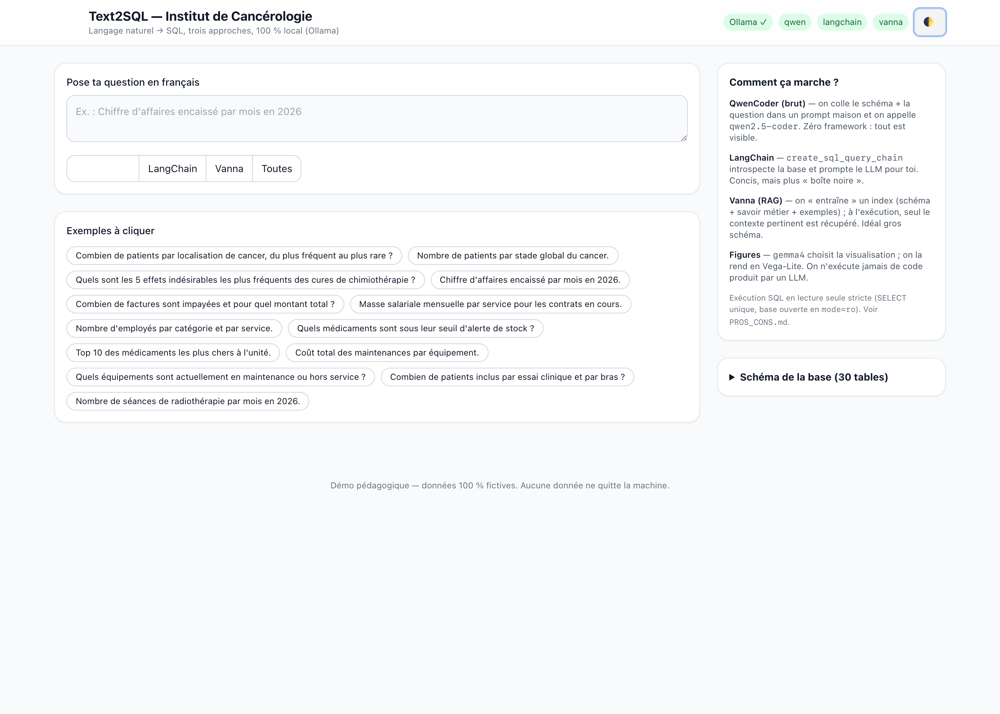
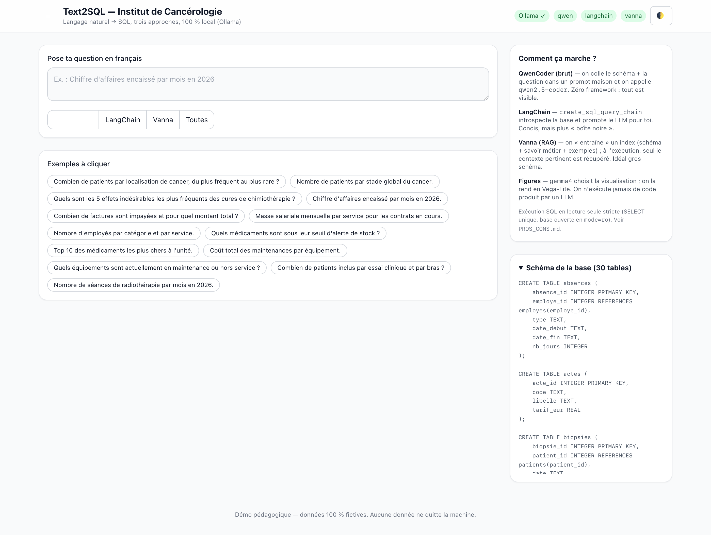
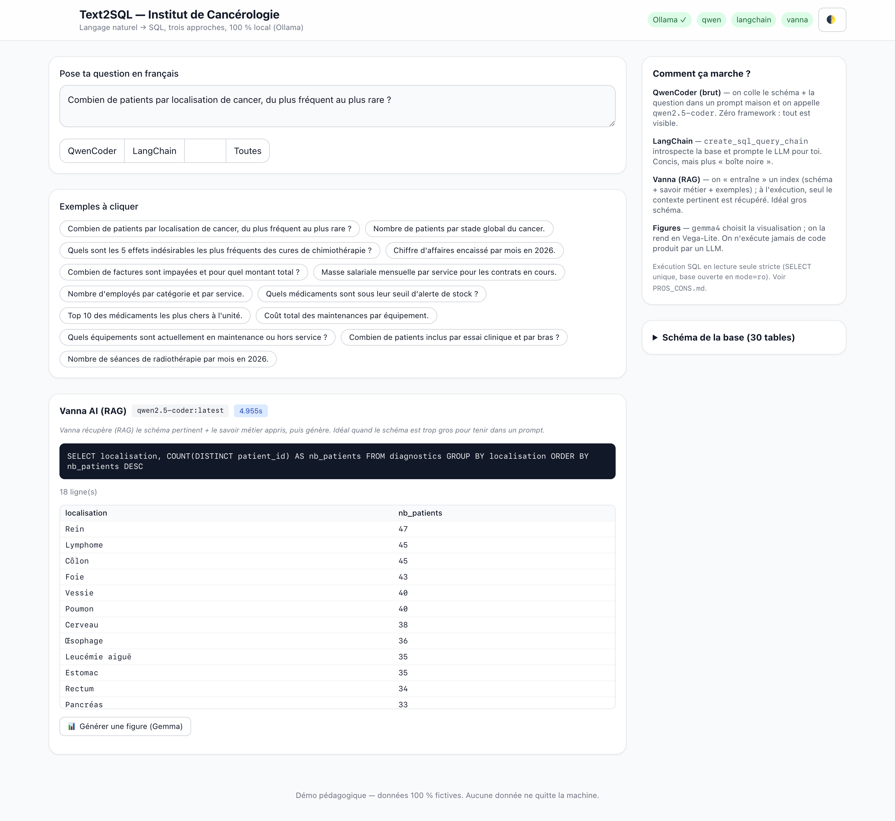
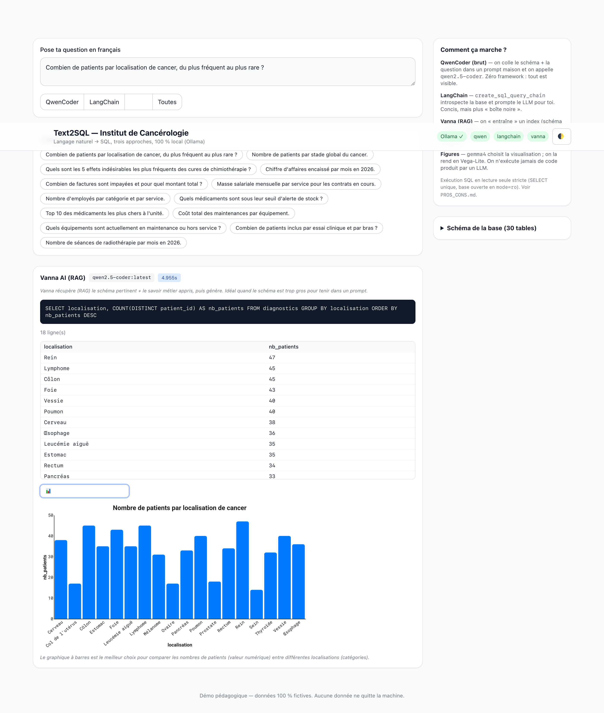
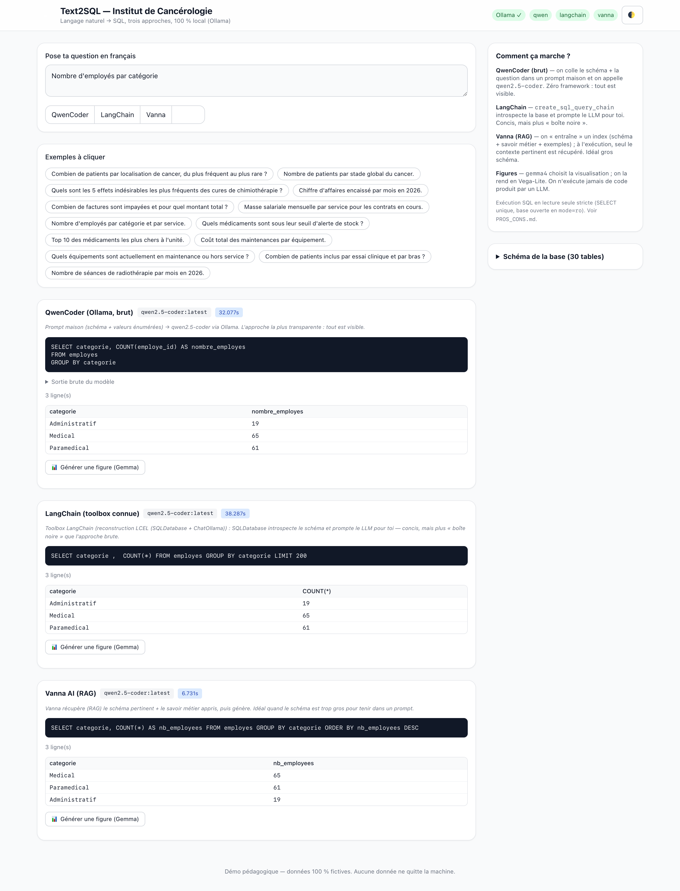

[🇫🇷](MODEDEMPLOI.md) · [🇬🇧](USERGUIDE.md)

# User guide — Text2SQL Cancer Institute

Illustrated, step-by-step tour of the web interface. For installation see
[README.md](README.md); for command-line recipes see [EXAMPLES.md](EXAMPLES.md).

> Prerequisites: `ollama serve` is running, the models are pulled, and you have
> launched `./start.sh` then opened <http://localhost:8000>.

---

## 1. The home screen

- **Top right**: **status badges**. `Ollama ✓` confirms the model server is
  reachable; one badge per approach (`qwen`, `langchain`, `vanna`) shows whether
  it is available (green) or not (red). The 🌓 button toggles light/dark theme.
- **Input area**: type your question **in French**.
- **Approach selector**: `QwenCoder`, `LangChain`, `Vanna`, or **`Toutes`** (all
  three at once, for comparison).
- **Clickable examples**: ready-made questions across every domain (medical, HR,
  accounting, pharmacy, equipment, research).
- **Right column** — "Comment ça marche?": a reminder of what each approach does,
  and access to the database schema.

## 2. Dark theme

The 🌓 button (or your system preference) switches the whole UI to dark. The
choice is remembered across visits.

## 3. Explore the schema

Expand **"Schéma de la base (30 tables)"** to see the full DDL — this is *exactly*
the context the models receive to write SQL. Handy for understanding why a query
joins one table or another.

## 4. Ask a question and run it

1. Click an example (or type your own). Tip: **Ctrl/Cmd + Enter** also runs it.
2. Pick an approach, then **Exécuter** (Run).
3. Each result shows, in order:
   - the **approach name**, the **model** used, and the **latency**;
   - a **teaching note** (what the approach does);
   - the **generated SQL** (the heart of the demo — always visible);
   - the **result table** (row count, preview).

Local models take a few seconds (more on the very first call, while the model
loads into memory).

## 5. Generate a figure (Gemma)

Click **📊 Générer une figure (Gemma)** below a table. The `gemma4` model picks
the right chart type (bar, line, pie, scatter, histogram) and the columns; the
figure is rendered as **Vega-Lite** in the browser. The sentence under the chart
explains *why* Gemma chose that visualization.

> Gemma may legitimately decide no figure makes sense (e.g. a single-row
> `COUNT(*)`): it will tell you rather than force a chart.

## 6. Compare the three approaches

Pick **`Toutes`** then **Exécuter**: all three approaches handle the same question
and stack under one another. This is the ideal view to show colleagues **how each
method writes SQL differently** — and to compare latencies and results.

---

## FAQ

- **An approach is greyed out / unavailable.** Its badge is red: the dependency
  is missing (`pip install ...`) or Ollama is down. QwenCoder needs no framework
  and works as soon as Ollama runs.
- **"Erreur d'exécution" (execution error).** The generated SQL was invalid —
  which is instructive: you see what the model produced and why it failed the
  read-only guard.
- **Nothing happens / very slow.** The first call loads the model; later calls
  are much faster.
- **Does my data leave the machine?** No. Everything is local (Ollama + SQLite).
  No request to any external service (apart from the front's web fonts).
